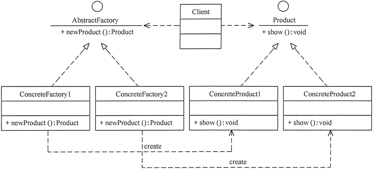
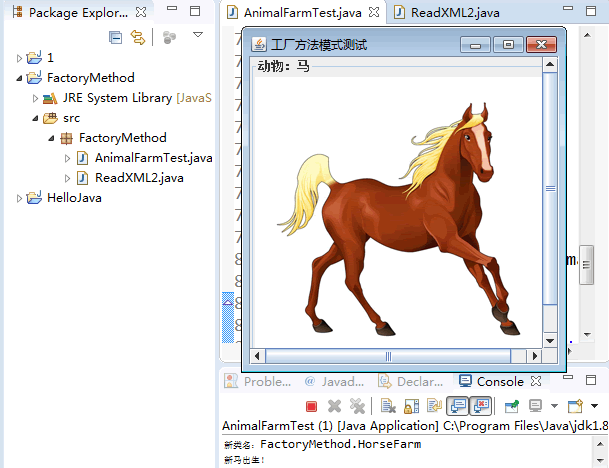
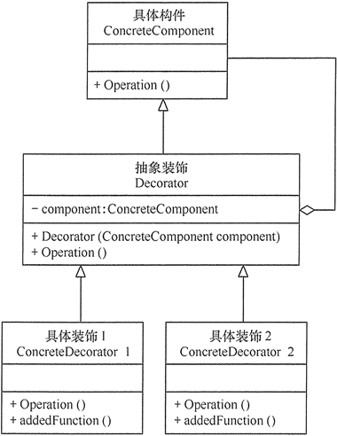
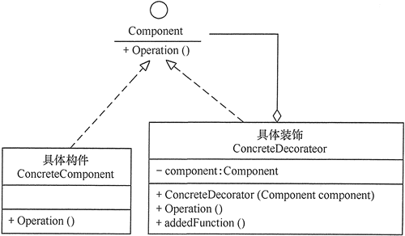
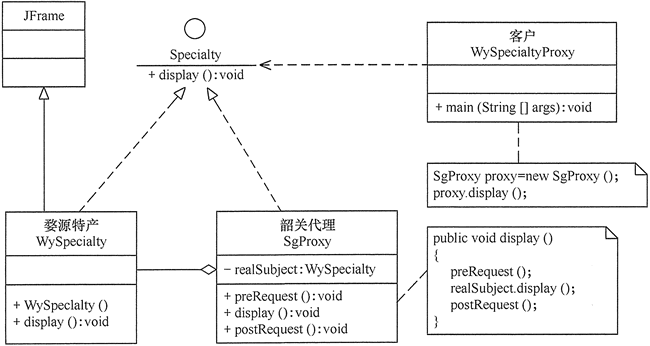
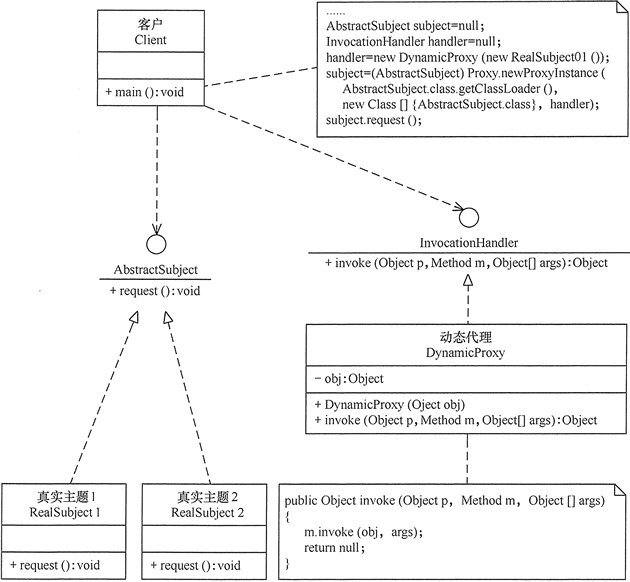
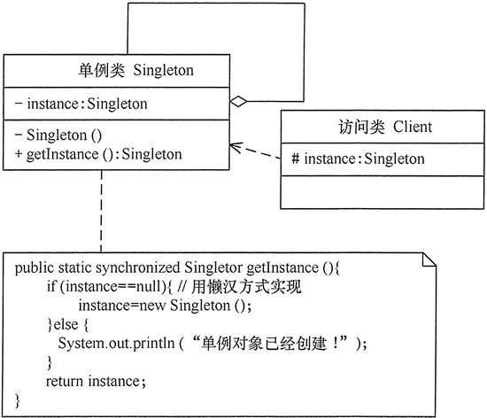
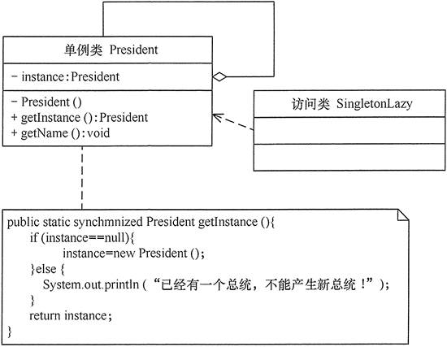
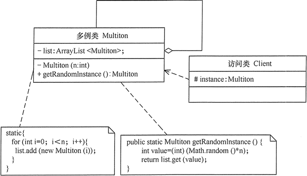
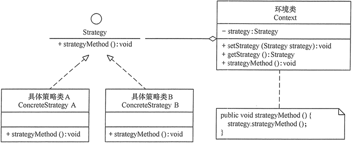

## 设计模式可以分为创建型、结构型和行为型。

### 创建型

对类的现实化进行了抽象，能够使软件模块做到与对象的创建和组织无关。

功能：类的创建

创建型: 单例模式、抽象工厂模式、建造者模式、工厂模式、原型模式

### 结构型

描述类和对象之间如何进行有效的组织，以形成良好的软件体系结构，主要的方式是使用继承关系来组织各个类。

功能： 组合代替、类与类之间的关系

结构型： 适配器模式、桥接模式、装饰模式、组合模式、外观模式、享元模式、代理模式

### 行为型

描述 类和对象之间如何交互以及如何分配职责

功能：关注对象与行为的分离、就是要把行为分离到类里面

行为型: 观察者模式、中介者模式、状态模式、解释器模式、策略模式、职责链模式、访问者模式、迭代器模式、命令模式、迭代器模式、备忘录模式

# 如何正确使用设计模式？

设计模式不是为每个人准备的，而是基于业务来选择设计模式，需要时就能想到它。要明白一点，技术永远为业务服务，技术只是满足业务需要的一个工具。我们需要掌握每种设计模式的应用场景、特征、优缺点，以及每种设计模式的关联关系，这样就能够很好地满足日常业务的需要。

许多设计模式的功能类似，界限不是特别清楚（为了能让大家更好的理解，每个章节后面都列出了类似功能设计模式之间的对比）。大家不要疑惑，设计模式不是为了特定场景而生的，而是为了让大家可以更好和更快地开发。

设计模式只是实现了七大设计原则的具体方式，套用太多设计模式只会陷入模式套路陷阱，最后代码写的凌乱不堪。

在实际工作中很少会规定必须使用哪种设计模式，这样只会限制别人。不能为了使用设计模式而去做架构，而是有了做架构的需求后，发现它符合某一类设计模式的结构，在将两者结合。

设计模式要活学活用，不要生搬硬套。想要游刃有余地使用设计模式，需要打下牢固的程序设计语言基础、夯实自己的编程思想、积累大量的时间经验、提高开发能力。目的都是让程序低耦合，高复用，高内聚，易扩展，易维护。

#### 1. 需求驱动

不仅仅是功能性需求，需求驱动还包括性能和运行时的需求，如软件的可维护性和可复用性等方面。设计模式是针对软件设计的，而软件设计是针对需求的，一定不要为了使用设计模式而使用设计模式，否则可能会使设计变得复杂，使软件难以调试和维护。

#### 2. 分析成功的模式应用项目

对现有的应用实例进行分析是一个很好的学习途径，应当注意学习已有的项目，而不仅是学习设计模式如何实现，更重要的是注意在什么场合使用设计模式。

#### 3. 充分了解所使用的开发平台

设计模式大部分都是针对面向对象的软件设计，因此在理论上适合任何面向对象的语言，但随着技术的发展和编程环境的改善，设计模式的实现方式会有很大的差别。在一些平台下，某些设计模式是自然实现的。

不仅指编程语言，平台还包括平台引入的技术。例如，Java EE 引入了反射机制和依赖注入，这些技术的使用使设计模式的实现方式产生了改变。

#### 4. 在编程中领悟模式

软件开发是一项实践工作，最直接的方法就是编程。没有从来不下棋却熟悉定式的围棋高手，也没有不会编程就能成为架构设计师的先例。掌握设计模式是水到渠成的事情，除了理论只是和实践积累，可能会“渐悟”或者“顿悟”。

#### 5.避免设计过度

设计模式解决的是设计不足的问题，但同时也要避免设计过度。一定要牢记简洁原则，要知道设计模式是为了使设计简单，而不是更复杂。如果引入设计模式使得设计变得复杂，只能说我们把简单问题复杂化了，问题本身不需要设计模式。

这里需要把握的是需求变化的程度，一定要区分需求的稳定部分和可变部分。一个软件必然有稳定部分，这个部分就是核心业务逻辑。如果核心业务逻辑发生变化，软件就没有存在的必要，核心业务逻辑是我们需要固化的。对于可变的部分，需要判断可能发生变化的程度来确定设计策略和设计风险。要知道，设计过度与设计不足同样对项目有害。

> 学习设计模式，死记硬背是没用的，还要从实践中理解，本教程后面会结合实例和源码来讲解如何使用设计模式。

需要特别声明的是，在日常应用中，设计模式从来都不是单个设计模式独立使用的。在实际应用中，通常多个设计模式混合使用，你中有我，我中有你。下图完整地描述了设计模式之间的混用关系，希望对大家有所帮助。


# 开闭原则——面向对象设计原则

在软件开发中，为了提高软件系统的可维护性和可复用性，增加软件的可扩展性和灵活性，程序员要尽量根据 7 条原则来开发程序，从而提高软件开发效率、节约软件开发成本和维护成本。我们将在下面的几节中依次来介绍这 7 条原则，本节首先介绍开闭原则。

## 开闭原则的定义

开闭原则（Open Closed Principle，OCP）由勃兰特·梅耶（Bertrand Meyer）提出，他在 1988 年的著作《面向对象软件构造》（Object Oriented Software Construction）中提出：软件实体应当对扩展开放，对修改关闭（Software entities should be open for extension，but closed for modification），这就是开闭原则的经典定义。

这里的软件实体包括以下几个部分：

1. 项目中划分出的模块
2. 类与接口
3. 方法

开闭原则的含义是：当应用的需求改变时，在不修改软件实体的源代码或者二进制代码的前提下，可以扩展模块的功能，使其满足新的需求。


## 开闭原则的作用

开闭原则是面向对象程序设计的终极目标，它使软件实体拥有一定的适应性和灵活性的同时具备稳定性和延续性。具体来说，其作用如下。

#### 1. 对软件测试的影响

软件遵守开闭原则的话，软件测试时只需要对扩展的代码进行测试就可以了，因为原有的测试代码仍然能够正常运行。

#### 2. 可以提高代码的可复用性

粒度越小，被复用的可能性就越大；在面向对象的程序设计中，根据原子和抽象编程可以提高代码的可复用性。

#### 3. 可以提高软件的可维护性

遵守开闭原则的软件，其稳定性高和延续性强，从而易于扩展和维护。

## 开闭原则的实现方法

可以通过“抽象约束、封装变化”来实现开闭原则，即通过接口或者抽象类为软件实体定义一个相对稳定的抽象层，而将相同的可变因素封装在相同的具体实现类中。

因为抽象灵活性好，适应性广，只要抽象的合理，可以基本保持软件架构的稳定。而软件中易变的细节可以从抽象派生来的实现类来进行扩展，当软件需要发生变化时，只需要根据需求重新派生一个实现类来扩展就可以了。

下面以 Windows 的桌面主题为例介绍开闭原则的应用。

#### 【例1】Windows 的桌面主题设计

分析：Windows 的主题是桌面背景图片、窗口颜色和声音等元素的组合。用户可以根据自己的喜爱更换自己的桌面主题，也可以从网上下载新的主题。这些主题有共同的特点，可以为其定义一个抽象类（Abstract Subject），而每个具体的主题（Specific Subject）是其子类。用户窗体可以根据需要选择或者增加新的主题，而不需要修改原代码，所以它是满足开闭原则的，其类图如图 1 所示。


图1 Windows的桌面主题类图

## 进阶阅读

如果您想了解开闭原则在实际项目中的应用，可以猛击阅读《[使用开闭原则解决实际问题](http://c.biancheng.net/view/vip_8376.html)》文章。

# 1.简单工厂模式

现实生活中，原始社会自给自足（没有工厂），农耕社会小作坊（简单工厂，民间酒坊），工业革命流水线（工厂方法，自产自销），现代产业链代工厂（抽象工厂，富士康）。我们的项目代码同样是由简到繁一步一步迭代而来的，但对于调用者来说，却越来越简单。

在日常开发中，凡是需要生成复杂对象的地方，都可以尝试考虑使用工厂模式来代替。

> 注意：上述复杂对象指的是类的构造函数参数过多等对类的构造有影响的情况，因为类的构造过于复杂，如果直接在其他业务类内使用，则两者的耦合过重，后续业务更改，就需要在任何引用该类的源代码内进行更改，光是查找所有依赖就很消耗时间了，更别说要一个一个修改了。

工厂模式的定义：定义一个创建产品对象的工厂接口，将产品对象的实际创建工作推迟到具体子工厂类当中。这满足创建型模式中所要求的“创建与使用相分离”的特点。

按实际业务场景划分，工厂模式有 3 种不同的实现方式，分别是简单工厂模式、工厂方法模式和抽象工厂模式。

我们把被创建的对象称为“产品”，把创建产品的对象称为“工厂”。如果要创建的产品不多，只要一个工厂类就可以完成，这种模式叫“简单工厂模式”。

在简单工厂模式中创建实例的方法通常为静态（static）方法，因此

简单工厂模式（Simple Factory Pattern）又叫作静态工厂方法模式（Static Factory Method Pattern）。

简单来说，简单工厂模式有一个具体的工厂类，可以生成多个不同的产品，属于创建型设计模式。简单工厂模式不在 GoF 23 种设计模式之列。

简单工厂模式每增加一个产品就要增加一个具体产品类和一个对应的具体工厂类，这增加了系统的复杂度，违背了“开闭原则”。

> “工厂方法模式”是对简单工厂模式的进一步抽象化，其好处是可以使系统在不修改原来代码的情况下引进新的产品，即满足开闭原则。

## 优点和缺点

#### 优点：

1. 工厂类包含必要的逻辑判断，可以决定在什么时候创建哪一个产品的实例。客户端可以免除直接创建产品对象的职责，很方便的创建出相应的产品。工厂和产品的职责区分明确。
2. 客户端无需知道所创建具体产品的类名，只需知道参数即可。
3. 也可以引入配置文件，在不修改客户端代码的情况下更换和添加新的具体产品类。

#### 缺点：

1. 简单工厂模式的工厂类单一，负责所有产品的创建，职责过重，一旦异常，整个系统将受影响。且工厂类代码会非常臃肿，违背高聚合原则。
2. 使用简单工厂模式会增加系统中类的个数（引入新的工厂类），增加系统的复杂度和理解难度
3. 系统扩展困难，一旦增加新产品不得不修改工厂逻辑，在产品类型较多时，可能造成逻辑过于复杂
4. 简单工厂模式使用了 static 工厂方法，造成工厂角色无法形成基于继承的等级结构。

#### 应用场景

对于产品种类相对较少的情况，考虑使用简单工厂模式。使用简单工厂模式的客户端只需要传入工厂类的参数，不需要关心如何创建对象的逻辑，可以很方便地创建所需产品。

## 模式的结构与实现

简单工厂模式的主要角色如下：

- 简单工厂（SimpleFactory）：是简单工厂模式的核心，负责实现创建所有实例的内部逻辑。工厂类的创建产品类的方法可以被外界直接调用，创建所需的产品对象。
- 抽象产品（Product）：是简单工厂创建的所有对象的父类，负责描述所有实例共有的公共接口。
- 具体产品（ConcreteProduct）：是简单工厂模式的创建目标。

其结构图如下图所示。

简单工厂模式的结构图
图 1 简单工厂模式的结构图


根据上图写出该模式的代码如下：

```java
public class Client {
    public static void main(String[] args) {
    }
    //抽象产品
    public interface Product {
        void show();
    }
    //具体产品：ProductA
    static class ConcreteProduct1 implements Product {
        public void show() {
            System.out.println("具体产品1显示...");
        }
    }
    //具体产品：ProductB
    static class ConcreteProduct2 implements Product {
        public void show() {
            System.out.println("具体产品2显示...");
        }
    }
    final class Const {
        static final int PRODUCT_A = 0;
        static final int PRODUCT_B = 1;
        static final int PRODUCT_C = 2;
    }
    static class SimpleFactory {
        public static Product makeProduct(int kind) {
            switch (kind) {
                case Const.PRODUCT_A:
                    return new ConcreteProduct1();
                case Const.PRODUCT_B:
                    return new ConcreteProduct2();
            }
            return null;
        }
    }
}
```

## 进阶阅读

如果您想了解简单工厂模式在框架源码中的应用，可猛击阅读《简单工厂模式在框架源码中的应用》文章。

# 2.工厂方法模式（详解版）

在现实生活中社会分工越来越细，越来越专业化。各种产品有专门的工厂生产，彻底告别了自给自足的小农经济时代，这大大缩短了产品的生产周期，提高了生产效率。同样，在软件开发中能否做到软件对象的生产和使用相分离呢？能否在满足“开闭原则”的前提下，客户随意增删或改变对软件相关对象的使用呢？这就是本节要讨论的问题。

在《简单工厂模式》一节我们介绍了简单工厂模式，提到了简单工厂模式违背了开闭原则，而“工厂方法模式”是对简单工厂模式的进一步抽象化，其好处是可以使系统在不修改原来代码的情况下引进新的产品，即满足开闭原则。

#### 优点：

- 用户只需要知道具体工厂的名称就可得到所要的产品，无须知道产品的具体创建过程。
- 灵活性增强，对于新产品的创建，只需多写一个相应的工厂类。
- 典型的解耦框架。高层模块只需要知道产品的抽象类，无须关心其他实现类，满足迪米特法则、依赖倒置原则和里氏替换原则。

#### 缺点：

- 类的个数容易过多，增加复杂度
- 增加了系统的抽象性和理解难度
- 抽象产品只能生产一种产品，此弊端可使用[抽象工厂模式](http://c.biancheng.net/view/1351.html)解决。

#### 应用场景：

- 客户只知道创建产品的工厂名，而不知道具体的产品名。如 TCL 电视工厂、海信电视工厂等。
- 创建对象的任务由多个具体子工厂中的某一个完成，而抽象工厂只提供创建产品的接口。
- 客户不关心创建产品的细节，只关心产品的品牌

## 模式的结构与实现

工厂方法模式由抽象工厂、具体工厂、抽象产品和具体产品等4个要素构成。本节来分析其基本结构和实现方法。

#### 1. 模式的结构

工厂方法模式的主要角色如下。

1. 抽象工厂（Abstract Factory）：提供了创建产品的接口，调用者通过它访问具体工厂的工厂方法 newProduct() 来创建产品。
2. 具体工厂（ConcreteFactory）：主要是实现抽象工厂中的抽象方法，完成具体产品的创建。
3. 抽象产品（Product）：定义了产品的规范，描述了产品的主要特性和功能。
4. 具体产品（ConcreteProduct）：实现了抽象产品角色所定义的接口，由具体工厂来创建，它同具体工厂之间一一对应。

其结构图如图 1 所示。


图1 工厂方法模式的结构图

#### 2. 模式的实现

根据图 1 写出该模式的代码如下：

```java
package FactoryMethod;
public class AbstractFactoryTest {    
    public static void main(String[] args) {        
        try {            
            Product a;            
            AbstractFactory af;            
            af = (AbstractFactory) ReadXML1.getObject();            
            a = af.newProduct();            
            a.show();        
        } catch (Exception e) {            
            System.out.println(e.getMessage());        
        }    
    }
}
//抽象产品：提供了产品的接口
interface Product {    public void show();}
//具体产品1：实现抽象产品中的抽象方法
class ConcreteProduct1 implements Product {    
    public void show() {        
        System.out.println("具体产品1显示...");    
    }
}
//具体产品2：实现抽象产品中的抽象方法
class ConcreteProduct2 implements Product {    
    public void show() {        
        System.out.println("具体产品2显示...");    
    }
}
//抽象工厂：提供了厂品的生成方法
interface AbstractFactory {    
    public Product newProduct();
}
//具体工厂1：实现了厂品的生成方法
class ConcreteFactory1 implements AbstractFactory {    
    public Product newProduct() {        
        System.out.println("具体工厂1生成-->具体产品1...");        
        return new ConcreteProduct1();    
    }
}
//具体工厂2：实现了厂品的生成方法
class ConcreteFactory2 implements AbstractFactory {    
    public Product newProduct() {        
        System.out.println("具体工厂2生成-->具体产品2...");        
        return new ConcreteProduct2();    
    }
}
package FactoryMethod;
import javax.xml.parsers.*;
import org.w3c.dom.*;
import java.io.*;
class ReadXML1 {    
    //该方法用于从XML配置文件中提取具体类类名，并返回一个实例对象    
    public static Object getObject() {        
        try {            
            //创建文档对象            
            DocumentBuilderFactory dFactory = DocumentBuilderFactory.newInstance();            
            DocumentBuilder builder = dFactory.newDocumentBuilder();            
            Document doc;            
            doc = builder.parse(new File("src/FactoryMethod/config1.xml"));            
            //获取包含类名的文本节点            
            NodeList nl = doc.getElementsByTagName("className");            
            Node classNode = nl.item(0).getFirstChild();            
            String cName = "FactoryMethod." + classNode.getNodeValue();            
            //System.out.println("新类名："+cName);            
            // 通过类名生成实例对象并将其返回            
            lass<?> c = Class.forName(cName);            
            Object obj = c.newInstance();            
            return obj;        
        } catch (Exception e) {            
            e.printStackTrace();            
            return null;        
        }    
    }
}
```

注意：该程序中用到了 XML 文件，如果想要获取该文件，请点击“

下载

”，就可以对其进行下载。

程序运行结果如下：

```
具体工厂1生成-->具体产品1...
具体产品1显示...
```

如果将 XML 配置文件中的 ConcreteFactory1 改为 ConcreteFactory2，则程序运行结果如下：

```
具体工厂2生成-->具体产品2...
具体产品2显示...
```

## 模式的应用实例

【例1】用工厂方法模式设计畜牧场。

分析：有很多种类的畜牧场，如养马场用于养马，养牛场用于养牛，所以该实例用工厂方法模式比较适合。

对养马场和养牛场等具体工厂类，只要定义一个生成动物的方法 newAnimal() 即可。由于要显示马类和牛类等具体产品类的图像，所以它们的构造函数中用到了 JPanel、JLabd 和 ImageIcon 等组件，并定义一个 show() 方法来显示它们。

客户端程序通过对象生成器类 ReadXML2 读取 XML 配置文件中的数据来决定养马还是养牛。其结构图如图 2 所示。


图2 畜牧场结构图

注意：该程序中用到了 XML 文件，并且要显示马类和牛类等具体产品类的图像，如果想要获取 HTML 文件和图片，请点击“

下载

”，就可以对其进行下载。

程序代码如下：

```java
package FactoryMethod;
import java.awt.*;
import javax.swing.*;

public class AnimalFarmTest {
    public static void main(String[] args) {
        try {
            Animal a;
            AnimalFarm af;
            af = (AnimalFarm) ReadXML2.getObject();
            a = af.newAnimal();
            a.show();
        } catch (Exception e) {
            System.out.println(e.getMessage());
        }
    }
}
//抽象产品：动物类
interface Animal {    public void show();}
//具体产品：马类
class Horse implements Animal {
    JScrollPane sp;
    JFrame jf = new JFrame("工厂方法模式测试");

    public Horse() {
        Container contentPane = jf.getContentPane();
        JPanel p1 = new JPanel();
        p1.setLayout(new GridLayout(1, 1));
        p1.setBorder(BorderFactory.createTitledBorder("动物：马"));
        sp = new JScrollPane(p1);
        contentPane.add(sp, BorderLayout.CENTER);
        JLabel l1 = new JLabel(new ImageIcon("src/A_Horse.jpg"));
        p1.add(l1);
        jf.pack();
        jf.setVisible(false);
        jf.setDefaultCloseOperation(JFrame.EXIT_ON_CLOSE);
        //用户点击窗口关闭
    }
    public void show() {
        jf.setVisible(true);
    }
}
//具体产品：牛类
class Cattle implements Animal {
    JScrollPane sp;
    JFrame jf = new JFrame("工厂方法模式测试");

    public Cattle() {
        Container contentPane = jf.getContentPane();
        JPanel p1 = new JPanel();
        p1.setLayout(new GridLayout(1, 1));
        p1.setBorder(BorderFactory.createTitledBorder("动物：牛"));
        sp = new JScrollPane(p1);
        contentPane.add(sp, BorderLayout.CENTER);
        JLabel l1 = new JLabel(new ImageIcon("src/A_Cattle.jpg"));
        p1.add(l1);
        jf.pack();
        jf.setVisible(false);
        jf.setDefaultCloseOperation(JFrame.EXIT_ON_CLOSE);
        //用户点击窗口关闭
    }
    public void show() {        
        jf.setVisible(true);
    }
}
//抽象工厂：畜牧场
interface AnimalFarm {    public Animal newAnimal();}
//具体工厂：养马场
class HorseFarm implements AnimalFarm {
    public Animal newAnimal() {
        System.out.println("新马出生！");
        return new Horse();
    }
}
//具体工厂：养牛场
class CattleFarm implements AnimalFarm {
    public Animal newAnimal() {
        System.out.println("新牛出生！");
        return new Cattle();
    }
}
package FactoryMethod;
import javax.xml.parsers.*;
import org.w3c.dom.*;
import java.io.*;

class ReadXML2 {
    public static Object getObject() {
        try {
            DocumentBuilderFactory dFactory = DocumentBuilderFactory.newInstance();
            DocumentBuilder builder = dFactory.newDocumentBuilder();
            Document doc;
            doc = builder.parse(new File("src/FactoryMethod/config2.xml"));
            NodeList nl = doc.getElementsByTagName("className");
            Node classNode = nl.item(0).getFirstChild();
            String cName = "FactoryMethod." + classNode.getNodeValue();
            System.out.println("新类名：" + cName);
            Class<?> c = Class.forName(cName);
            Object obj = c.newInstance();
            return obj;
        } catch (Exception e) {
            e.printStackTrace();
            return null;
        }
    }
}
```

程序的运行结果如图 3 所示。


图3 畜牧场养殖的运行结果

注意：当需要生成的产品不多且不会增加，一个具体工厂类就可以完成任务时，可删除抽象工厂类。这时工厂方法模式将退化到简单工厂模式。


## 进阶阅读

如果您想了解工厂方法模式在框架源码中的应用，可猛击阅读《工厂方法模式在Logback源码中的应用》文章。

# 3.抽象工厂模式（详解版）


前面介绍的工厂方法模式中考虑的是一类产品的生产，如畜牧场只养动物、电视机厂只生产电视机、计算机软件学院只培养计算机软件专业的学生等。

同种类称为同等级，也就是说：工厂方法模式

只考虑生产同等级的产品，但是在现实生活中许多工厂是综合型的工厂，能生产多等级（种类） 的产品，如农场里既养动物又种植物，电器厂既生产电视机又生产洗衣机或空调，大学既有软件专业又有生物专业等。

本节要介绍的抽象工厂模式将考虑多等级产品的生产，将同一个具体工厂所生产的位于不同等级的一组产品称为一个产品族，图 1 所示的是海尔工厂和 TCL 工厂所生产的电视机与空调对应的关系图。


图1 电器工厂的产品等级与产品族

## 模式的定义与特点

抽象工厂（AbstractFactory）模式的定义：是一种为访问类提供一个创建一组相关或相互依赖对象的接口，且访问类无须指定所要产品的具体类就能得到同族的不同等级的产品的模式结构。

抽象工厂模式是工厂方法模式的升级版本，工厂方法模式只生产一个等级的产品，而抽象工厂模式可生产多个等级的产品。

使用抽象工厂模式一般要满足以下条件。

- 系统中有多个产品族，每个具体工厂创建同一族但属于不同等级结构的产品。
- 系统一次只可能消费其中某一族产品，即同族的产品一起使用。

抽象工厂模式除了具有工厂方法模式的优点外，其他主要优点如下。

- 可以在类的内部对产品族中相关联的多等级产品共同管理，而不必专门引入多个新的类来进行管理。
- 当需要产品族时，抽象工厂可以保证客户端始终只使用同一个产品的产品组。
- 抽象工厂增强了程序的可扩展性，当增加一个新的产品族时，不需要修改原代码，满足开闭原则。

其缺点是：当产品族中需要增加一个新的产品时，所有的工厂类都需要进行修改。增加了系统的抽象性和理解难度。

## 模式的结构与实现

抽象工厂模式同工厂方法模式一样，也是由抽象工厂、具体工厂、抽象产品和具体产品等 4 个要素构成，但抽象工厂中方法个数不同，抽象产品的个数也不同。现在我们来分析其基本结构和实现方法。

#### 1. 模式的结构

抽象工厂模式的主要角色如下。

1. 抽象工厂（Abstract Factory）：提供了创建产品的接口，它包含多个创建产品的方法 newProduct()，可以创建多个不同等级的产品。
2. 具体工厂（Concrete Factory）：主要是实现抽象工厂中的多个抽象方法，完成具体产品的创建。
3. 抽象产品（Product）：定义了产品的规范，描述了产品的主要特性和功能，抽象工厂模式有多个抽象产品。
4. 具体产品（ConcreteProduct）：实现了抽象产品角色所定义的接口，由具体工厂来创建，它同具体工厂之间是多对一的关系。

抽象工厂模式的结构图如图 2 所示。


图2 抽象工厂模式的结构图

#### 2. 模式的实现

从图 2 可以看出抽象工厂模式的结构同工厂方法模式的结构相似，不同的是其产品的种类不止一个，所以创建产品的方法也不止一个。下面给出抽象工厂和具体工厂的代码。

(1) 抽象工厂：提供了产品的生成方法。

```java
interface AbstractFactory {
    public Product1 newProduct1();
    public Product2 newProduct2();
}
```

(2) 具体工厂：实现了产品的生成方法。

```java
class ConcreteFactory1 implements AbstractFactory {
    public Product1 newProduct1() {
        System.out.println("具体工厂 1 生成-->具体产品 11...");
        return new ConcreteProduct11();
    }
    public Product2 newProduct2() {
        System.out.println("具体工厂 1 生成-->具体产品 21...");
        return new ConcreteProduct21();
    }
}
```


## 模式的应用实例

【例1】用抽象工厂模式设计农场类。

分析：农场中除了像畜牧场一样可以养动物，还可以培养植物，如养马、养牛、种菜、种水果等，所以本实例比前面介绍的畜牧场类复杂，必须用抽象工厂模式来实现。

本例用抽象工厂模式来设计两个农场，一个是韶关农场用于养牛和种菜，一个是上饶农场用于养马和种水果，可以在以上两个农场中定义一个生成动物的方法 newAnimal() 和一个培养植物的方法 newPlant()。

对马类、牛类、蔬菜类和水果类等具体产品类，由于要显示它们的图像（点此下载图片），所以它们的构造函数中用到了 JPanel、JLabel 和 ImageIcon 等组件，并定义一个 show() 方法来显示它们。

客户端程序通过对象生成器类 ReadXML 读取 XML 配置文件中的数据来决定养什么动物和培养什么植物（点此下载 XML 文件）。其结构图如图 3 所示。


图3 农场类的结构图

程序代码如下：

```java
package AbstractFactory;
import java.awt.*;
import javax.swing.*;
public class FarmTest {
    public static void main(String[] args) {
        try {
            Farm f;
            Animal a;
            Plant p;
            f = (Farm) ReadXML.getObject();
            a = f.newAnimal();
            p = f.newPlant();
            a.show();
            p.show();
        } catch (Exception e) {
            System.out.println(e.getMessage());
        }
    }
}
//抽象产品：动物类
interface Animal {
    public void show();
}
//具体产品：马类
class Horse implements Animal {
    JScrollPane sp;
    JFrame jf = new JFrame("抽象工厂模式测试");
    public Horse() {
        Container contentPane = jf.getContentPane();
        JPanel p1 = new JPanel();
        p1.setLayout(new GridLayout(1, 1));
        p1.setBorder(BorderFactory.createTitledBorder("动物：马"));
        sp = new JScrollPane(p1);
        contentPane.add(sp, BorderLayout.CENTER);
        JLabel l1 = new JLabel(new ImageIcon("src/A_Horse.jpg"));
        p1.add(l1);
        jf.pack();
        jf.setVisible(false);
        jf.setDefaultCloseOperation(JFrame.EXIT_ON_CLOSE);//用户点击窗口关闭
    }
    public void show() {
        jf.setVisible(true);
    }
}
//具体产品：牛类
class Cattle implements Animal {
    JScrollPane sp;
    JFrame jf = new JFrame("抽象工厂模式测试");
    public Cattle() {
        Container contentPane = jf.getContentPane();
        JPanel p1 = new JPanel();
        p1.setLayout(new GridLayout(1, 1));
        p1.setBorder(BorderFactory.createTitledBorder("动物：牛"));
        sp = new JScrollPane(p1);
        contentPane.add(sp, BorderLayout.CENTER);
        JLabel l1 = new JLabel(new ImageIcon("src/A_Cattle.jpg"));
        p1.add(l1);
        jf.pack();
        jf.setVisible(false);
        jf.setDefaultCloseOperation(JFrame.EXIT_ON_CLOSE);//用户点击窗口关闭
    }
    public void show() {
        jf.setVisible(true);
    }
}
//抽象产品：植物类
interface Plant {
    public void show();
}
//具体产品：水果类
class Fruitage implements Plant {
    JScrollPane sp;
    JFrame jf = new JFrame("抽象工厂模式测试");
    public Fruitage() {
        Container contentPane = jf.getContentPane();
        JPanel p1 = new JPanel();
        p1.setLayout(new GridLayout(1, 1));
        p1.setBorder(BorderFactory.createTitledBorder("植物：水果"));
        sp = new JScrollPane(p1);
        contentPane.add(sp, BorderLayout.CENTER);
        JLabel l1 = new JLabel(new ImageIcon("src/P_Fruitage.jpg"));
        p1.add(l1);
        jf.pack();
        jf.setVisible(false);
        jf.setDefaultCloseOperation(JFrame.EXIT_ON_CLOSE);//用户点击窗口关闭
    }
    public void show() {
        jf.setVisible(true);
    }
}
//具体产品：蔬菜类
class Vegetables implements Plant {
    JScrollPane sp;
    JFrame jf = new JFrame("抽象工厂模式测试");
    public Vegetables() {
        Container contentPane = jf.getContentPane();
        JPanel p1 = new JPanel();
        p1.setLayout(new GridLayout(1, 1));
        p1.setBorder(BorderFactory.createTitledBorder("植物：蔬菜"));
        sp = new JScrollPane(p1);
        contentPane.add(sp, BorderLayout.CENTER);
        JLabel l1 = new JLabel(new ImageIcon("src/P_Vegetables.jpg"));
        p1.add(l1);
        jf.pack();
        jf.setVisible(false);
        jf.setDefaultCloseOperation(JFrame.EXIT_ON_CLOSE);//用户点击窗口关闭
    }
    public void show() {
        jf.setVisible(true);
    }
}
//抽象工厂：农场类
interface Farm {
    public Animal newAnimal();
    public Plant newPlant();
}
//具体工厂：韶关农场类
class SGfarm implements Farm {
    public Animal newAnimal() {
        System.out.println("新牛出生！");
        return new Cattle();
    }
    public Plant newPlant() {
        System.out.println("蔬菜长成！");
        return new Vegetables();
    }
}
//具体工厂：上饶农场类
class SRfarm implements Farm {
    public Animal newAnimal() {
        System.out.println("新马出生！");
        return new Horse();
    }
    public Plant newPlant() {
        System.out.println("水果长成！");
        return new Fruitage();
    }
}

package AbstractFactory;
import javax.xml.parsers.*;
import org.w3c.dom.*;
import java.io.*;
class ReadXML {
    public static Object getObject() {
        try {
            DocumentBuilderFactory dFactory = DocumentBuilderFactory.newInstance();
            DocumentBuilder builder = dFactory.newDocumentBuilder();
            Document doc;
            doc = builder.parse(new File("src/AbstractFactory/config.xml"));
            NodeList nl = doc.getElementsByTagName("className");
            Node classNode = nl.item(0).getFirstChild();
            String cName = "AbstractFactory." + classNode.getNodeValue();
            System.out.println("新类名：" + cName);
            Class<?> c = Class.forName(cName);
            Object obj = c.newInstance();
            return obj;
        } catch (Exception e) {
            e.printStackTrace();
            return null;
        }
    }
}
```


程序运行结果如图 4 所示。


图4 农场养殖的运行结果

## 模式的应用场景

抽象工厂模式最早的应用是用于创建属于不同操作系统的视窗构件。

如 Java的 AWT 中的 Button 和 Text 等构件在 Windows 和 UNIX 中的本地实现是不同的。

抽象工厂模式通常适用于以下场景：

1. 当需要创建的对象是一系列相互关联或相互依赖的产品族时，如电器工厂中的电视机、洗衣机、空调等。
2. 系统中有多个产品族，但每次只使用其中的某一族产品。如有人只喜欢穿某一个品牌的衣服和鞋。
3. 系统中提供了产品的类库，且所有产品的接口相同，客户端不依赖产品实例的创建细节和内部结构。

## 模式的扩展

抽象工厂模式的扩展有一定的“开闭原则”倾斜性：

1. 当增加一个新的产品族时只需增加一个新的具体工厂，不需要修改原代码，满足开闭原则。
2. 当产品族中需要增加一个新种类的产品时，则所有的工厂类都需要进行修改，不满足开闭原则。

另一方面，当系统中只存在一个等级结构的产品时，抽象工厂模式将退化到工厂方法模式。

## 进阶阅读

如果您想了解抽象工厂在框架源码中的应用，可猛击阅读以下文章。

- [《抽象工厂在Java源码中的应用》](http://c.biancheng.net/view/vip_8392.html)
- [《抽象工厂模式在Spring源码中的应用》](http://c.biancheng.net/view/vip_8393.html)

# 4.装饰器模式（装饰设计模式）详解

上班族大多都有睡懒觉的习惯，每天早上上班时间都很紧张，于是很多人为了多睡一会，就会用方便的方式解决早餐问题。有些人早餐可能会吃煎饼，煎饼中可以加鸡蛋，也可以加香肠，但是不管怎么“加码”，都还是一个煎饼。在现实生活中，常常需要对现有产品增加新的功能或美化其外观，如房子装修、相片加相框等，都是装饰器模式。

在软件开发过程中，有时想用一些现存的组件。这些组件可能只是完成了一些核心功能。但在不改变其结构的情况下，可以动态地扩展其功能。所有这些都可以釆用装饰器模式来实现。

## 装饰器模式的定义与特点

装饰器（Decorator）模式的定义：指在不改变现有对象结构的情况下，动态地给该对象增加一些职责（即增加其额外功能）的模式，它属于对象结构型模式。

装饰器模式的主要优点有：

- 装饰器是继承的有力补充，比继承灵活，在不改变原有对象的情况下，动态的给一个对象扩展功能，即插即用
- 通过使用不用装饰类及这些装饰类的排列组合，可以实现不同效果
- 装饰器模式完全遵守开闭原则

其主要缺点是：装饰器模式会增加许多子类，过度使用会增加程序得复杂性。

## 装饰器模式的结构与实现

通常情况下，扩展一个类的功能会使用继承方式来实现。但继承具有静态特征，耦合度高，并且随着扩展功能的增多，子类会很膨胀。如果使用组合关系来创建一个包装对象（即装饰对象）来包裹真实对象，并在保持真实对象的类结构不变的前提下，为其提供额外的功能，这就是装饰器模式的目标。下面来分析其基本结构和实现方法。

#### 1. 模式的结构

装饰器模式主要包含以下角色。

1. 抽象构件（Component）角色：定义一个抽象接口以规范准备接收附加责任的对象。
2. 具体构件（ConcreteComponent）角色：实现抽象构件，通过装饰角色为其添加一些职责。
3. 抽象装饰（Decorator）角色：继承抽象构件，并包含具体构件的实例，可以通过其子类扩展具体构件的功能。
4. 具体装饰（ConcreteDecorator）角色：实现抽象装饰的相关方法，并给具体构件对象添加附加的责任。

装饰器模式的结构图如图 1 所示。


图1 装饰器模式的结构图

#### 2. 模式的实现

装饰器模式的实现代码如下：

```java
package decorator;
public class DecoratorPattern {
    public static void main(String[] args) {
        Component p = new ConcreteComponent();
        p.operation();
        System.out.println("---------------------------------");
        Component d = new ConcreteDecorator(p);
        d.operation();
    }
}
//抽象构件角色
interface Component {
    public void operation();
}
//具体构件角色
class ConcreteComponent implements Component {
    public ConcreteComponent() {
        System.out.println("创建具体构件角色");
    }
    public void operation() {
        System.out.println("调用具体构件角色的方法operation()");
    }
}
//抽象装饰角色
class Decorator implements Component {
    private Component component;
    public Decorator(Component component) {
        this.component = component;
    }
    public void operation() {
        component.operation();
    }
}
//具体装饰角色
class ConcreteDecorator extends Decorator {
    public ConcreteDecorator(Component component) {
        super(component);
    }
    public void operation() {
        super.operation();
        addedFunction();
    }
    public void addedFunction() {
        System.out.println("为具体构件角色增加额外的功能addedFunction()");
    }
}
```


程序运行结果如下：

```
创建具体构件角色
调用具体构件角色的方法operation()
---------------------------------
调用具体构件角色的方法operation()
为具体构件角色增加额外的功能addedFunction()
```


## 装饰器模式的应用实例

【例1】用装饰器模式实现游戏角色“莫莉卡·安斯兰”的变身。

分析：在《恶魔战士》中，游戏角色“莫莉卡·安斯兰”的原身是一个可爱少女，但当她变身时，会变成头顶及背部延伸出蝙蝠状飞翼的女妖，当然她还可以变为穿着漂亮外衣的少女。这些都可用装饰器模式来实现，在本实例中的“莫莉卡”原身有 setImage(String t) 方法决定其显示方式，而其 变身“蝙蝠状女妖”和“着装少女”可以用 setChanger() 方法来改变其外观，原身与变身后的效果用 display() 方法来显示（点此下载其原身和变身后的图片），图 2 所示是其结构图。


图2 游戏角色“莫莉卡·安斯兰”的结构图

程序代码如下：

```java
package decorator;
import java.awt.*;
import javax.swing.*;
public class MorriganAensland {
    public static void main(String[] args) {
        Morrigan m0 = new original();
        m0.display();
        Morrigan m1 = new Succubus(m0);
        m1.display();
        Morrigan m2 = new Girl(m0);
        m2.display();
    }
}
//抽象构件角色：莫莉卡
interface Morrigan {
    public void display();
}
//具体构件角色：原身
class original extends JFrame implements Morrigan {
    private static final long serialVersionUID = 1L;
    private String t = "Morrigan0.jpg";
    public original() {
        super("《恶魔战士》中的莫莉卡·安斯兰");
    }
    public void setImage(String t) {
        this.t = t;
    }
    public void display() {
        this.setLayout(new FlowLayout());
        JLabel l1 = new JLabel(new ImageIcon("src/decorator/" + t));
        this.add(l1);
        this.pack();
        this.setDefaultCloseOperation(JFrame.EXIT_ON_CLOSE);
        this.setVisible(true);
    }
}
//抽象装饰角色：变形
class Changer implements Morrigan {
    Morrigan m;
    public Changer(Morrigan m) {
        this.m = m;
    }
    public void display() {
        m.display();
    }
}
//具体装饰角色：女妖
class Succubus extends Changer {
    public Succubus(Morrigan m) {
        super(m);
    }
    public void display() {
        setChanger();
        super.display();
    }
    public void setChanger() {
        ((original) super.m).setImage("Morrigan1.jpg");
    }
}
//具体装饰角色：少女
class Girl extends Changer {
    public Girl(Morrigan m) {
        super(m);
    }
    public void display() {
        setChanger();
        super.display();
    }
    public void setChanger() {
        ((original) super.m).setImage("Morrigan2.jpg");
    }
}
```

程序运行结果如图 3 所示。


图3 游戏角色“莫莉卡·安斯兰”的变身

## 装饰器模式的应用场景

前面讲解了关于装饰器模式的结构与特点，下面介绍其适用的应用场景，装饰器模式通常在以下几种情况使用。

- 当需要给一个现有类添加附加职责，而又不能采用生成子类的方法进行扩充时。例如，该类被隐藏或者该类是终极类或者采用继承方式会产生大量的子类。
- 当需要通过对现有的一组基本功能进行排列组合而产生非常多的功能时，采用继承关系很难实现，而采用装饰器模式却很好实现。
- 当对象的功能要求可以动态地添加，也可以再动态地撤销时。

装饰器模式在 

Java语言中的最著名的应用莫过于 Java I/O 标准库的设计了。例如，InputStream 的子类 FilterInputStream，OutputStream 的子类 FilterOutputStream，Reader 的子类 BufferedReader 以及 FilterReader，还有 Writer 的子类 BufferedWriter、FilterWriter 以及 PrintWriter 等，它们都是抽象装饰类。

下面代码是为 FileReader 增加缓冲区而采用的装饰类 BufferedReader 的例子：

```java
BufferedReader in = new BufferedReader(new FileReader("filename.txt"));
String s = in.readLine();
```

## 装饰器模式的扩展

装饰器模式所包含的 4 个角色不是任何时候都要存在的，在有些应用环境下模式是可以简化的，如以下两种情况。

(1) 如果只有一个具体构件而没有抽象构件时，可以让抽象装饰继承具体构件，其结构图如图 4 所示。


图4 只有一个具体构件的装饰器模式

(2) 如果只有一个具体装饰时，可以将抽象装饰和具体装饰合并，其结构图如图 5 所示。


图5 只有一个具体装饰的装饰器模式

## 进阶阅读

如果您想深入了解装饰器模式，可猛击阅读以下文章。

- [《使用装饰器模式解决煎饼“加码”问题》](http://c.biancheng.net/view/vip_8461.html)
- [《装饰器模式在JDK源码中的应用》](http://c.biancheng.net/view/vip_8463.html)
- [《装饰器模式在Spring源码中的应用》](http://c.biancheng.net/view/vip_8464.html)
- [《装饰器模式和代理模式的区别》](http://c.biancheng.net/view/vip_8466.html)


# 5.适配器模式（Adapter模式）详解

在现实生活中，经常出现两个对象因接口不兼容而不能在一起工作的实例，这时需要第三者进行适配。例如，讲中文的人同讲英文的人对话时需要一个翻译，用直流电的笔记本电脑接交流电源时需要一个电源适配器，用计算机访问照相机的 SD 内存卡时需要一个读卡器等。

在软件设计中也可能出现：需要开发的具有某种业务功能的组件在现有的组件库中已经存在，但它们与当前系统的接口规范不兼容，如果重新开发这些组件成本又很高，这时用适配器模式能很好地解决这些问题。

## 模式的定义与特点

适配器模式（Adapter）的定义如下：将一个类的接口转换成客户希望的另外一个接口，使得原本由于接口不兼容而不能一起工作的那些类能一起工作。

适配器模式分为类结构型模式和对象结构型模式两种，前者类之间的耦合度比后者高，且要求程序员了解现有组件库中的相关组件的内部结构，所以应用相对较少些。

该模式的主要优点如下。

- 客户端通过适配器可以透明地调用目标接口。
- 复用了现存的类，程序员不需要修改原有代码而重用现有的适配者类。
- 将目标类和适配者类解耦，解决了目标类和适配者类接口不一致的问题。
- 在很多业务场景中符合开闭原则。

其缺点是：

- 适配器编写过程需要结合业务场景全面考虑，可能会增加系统的复杂性。
- 增加代码阅读难度，降低代码可读性，过多使用适配器会使系统代码变得凌乱。

## 模式的结构与实现

类适配器模式可采用多重继承方式实现，如 C++可定义一个适配器类来同时继承当前系统的业务接口和现有组件库中已经存在的组件接口；Java不支持多继承，但可以定义一个适配器类来实现当前系统的业务接口，同时又继承现有组件库中已经存在的组件。对象适配器模式可釆用将现有组件库中已经实现的组件引入适配器类中，该类同时实现当前系统的业务接口。现在来介绍它们的基本结构。

#### 1. 模式的结构

适配器模式（Adapter）包含以下主要角色。

1. 目标（Target）接口：当前系统业务所期待的接口，它可以是抽象类或接口。
2. 适配者（Adaptee）类：它是被访问和适配的现存组件库中的组件接口。
3. 适配器（Adapter）类：它是一个转换器，通过继承或引用适配者的对象，把适配者接口转换成目标接口，让客户按目标接口的格式访问适配者。

类适配器模式的结构图如图 1 所示。


图1 类适配器模式的结构图

对象适配器模式的结构图如图 2 所示。


图2 对象适配器模式的结构图

#### 2. 模式的实现

(1) 类适配器模式的代码如下。

```java
package adapter;
//目标接口
interface Target
{
    public void request();
}
//适配者接口
class Adaptee
{
    public void specificRequest()
    {       
        System.out.println("适配者中的业务代码被调用！");
    }
}
//类适配器类
class ClassAdapter extends Adaptee implements Target
{
    public void request()
    {
        specificRequest();
    }
}
//客户端代码
public class ClassAdapterTest
{
    public static void main(String[] args)
    {
        System.out.println("类适配器模式测试：");
        Target target = new ClassAdapter();
        target.request();
    }
}
```

程序的运行结果如下：

```
类适配器模式测试：
适配者中的业务代码被调用！
```

(2)对象适配器模式的代码如下。

```java
package adapter;
//对象适配器类
class ObjectAdapter implements Target
{
    private Adaptee adaptee;
    public ObjectAdapter(Adaptee adaptee)
    {
        this.adaptee=adaptee;
    }
    public void request()
    {
        adaptee.specificRequest();
    }
}
//客户端代码
public class ObjectAdapterTest
{
    public static void main(String[] args)
    {
        System.out.println("对象适配器模式测试：");
        Adaptee adaptee = new Adaptee();
        Target target = new ObjectAdapter(adaptee);
        target.request();
    }
}
```

说明：对象适配器模式中的“目标接口”和“适配者类”的代码同类适配器模式一样，只要修改适配器类和客户端的代码即可。

程序的运行结果如下：

```
对象适配器模式测试：
适配者中的业务代码被调用！
```

## 模式的应用实例

【例1】用适配器模式（Adapter）模拟新能源汽车的发动机。

分析：新能源汽车的发动机有电能发动机（Electric Motor）和光能发动机（Optical Motor）等，各种发动机的驱动方法不同，例如，电能发动机的驱动方法 electricDrive() 是用电能驱动，而光能发动机的驱动方法 opticalDrive() 是用光能驱动，它们是适配器模式中被访问的适配者。

客户端希望用统一的发动机驱动方法 drive() 访问这两种发动机，所以必须定义一个统一的目标接口 Motor，然后再定义电能适配器（Electric Adapter）和光能适配器（Optical Adapter）去适配这两种发动机。

我们把客户端想访问的新能源发动机的适配器的名称放在 XML 配置文件中（点此下载 XML 文件），客户端可以通过对象生成器类 ReadXML 去读取。这样，客户端就可以通过 Motor 接口随便使用任意一种新能源发动机去驱动汽车，图 3 所示是其结构图。


图3 发动机适配器的结构图

程序代码如下：

```java
package adapter;
//目标：发动机
interface Motor
{
    public void drive();
}
//适配者1：电能发动机
class ElectricMotor
{
    public void electricDrive()
    {
        System.out.println("电能发动机驱动汽车！");
    }
}
//适配者2：光能发动机
class OpticalMotor
{
    public void opticalDrive()
    {
        System.out.println("光能发动机驱动汽车！");
    }
}
//电能适配器
class ElectricAdapter implements Motor
{
    private ElectricMotor emotor;
    public ElectricAdapter()
    {
        emotor=new ElectricMotor();
    }
    public void drive()
    {
        emotor.electricDrive();
    }
}
//光能适配器
class OpticalAdapter implements Motor
{
    private OpticalMotor omotor;
    public OpticalAdapter()
    {
        omotor=new OpticalMotor();
    }
    public void drive()
    {
        omotor.opticalDrive();
    }
}
//客户端代码
public class MotorAdapterTest
{
    public static void main(String[] args)
    {
        System.out.println("适配器模式测试：");
        Motor motor=(Motor)ReadXML.getObject();
        motor.drive();
    }
}

package adapter;
import javax.xml.parsers.*;
import org.w3c.dom.*;
import java.io.*;
class ReadXML
{
    public static Object getObject()
    {
        try
        {
            DocumentBuilderFactory dFactory=DocumentBuilderFactory.newInstance();
            DocumentBuilder builder=dFactory.newDocumentBuilder();
            Document doc;                           
            doc=builder.parse(new File("src/adapter/config.xml"));
            NodeList nl=doc.getElementsByTagName("className");
            Node classNode=nl.item(0).getFirstChild();
            String cName="adapter."+classNode.getNodeValue();
            Class<?> c=Class.forName(cName);
              Object obj=c.newInstance();
            return obj;
         }  
         catch(Exception e)
         {
                   e.printStackTrace();
                   return null;
         }
    }
}
```

程序的运行结果如下：

```
适配器模式测试：
电能发动机驱动汽车！
```

注意：如果将配置文件中的 ElectricAdapter 改为 OpticalAdapter，则运行结果如下：

```
适配器模式测试：
光能发动机驱动汽车！
```

## 模式的应用场景

适配器模式（Adapter）通常适用于以下场景。

- 以前开发的系统存在满足新系统功能需求的类，但其接口同新系统的接口不一致。
- 使用第三方提供的组件，但组件接口定义和自己要求的接口定义不同。

## 模式的扩展

适配器模式（Adapter）可扩展为双向适配器模式，双向适配器类既可以把适配者接口转换成目标接口，也可以把目标接口转换成适配者接口，其结构图如图 4 所示。


图4 双向适配器模式的结构图

程序代码如下：

```java
package adapter;
//目标接口
interface TwoWayTarget
{
    public void request();
}
//适配者接口
interface TwoWayAdaptee
{
    public void specificRequest();
}
//目标实现
class TargetRealize implements TwoWayTarget
{
    public void request()
    {       
        System.out.println("目标代码被调用！");
    }
}
//适配者实现
class AdapteeRealize implements TwoWayAdaptee
{
    public void specificRequest()
    {       
        System.out.println("适配者代码被调用！");
    }
}
//双向适配器
class TwoWayAdapter  implements TwoWayTarget,TwoWayAdaptee
{
    private TwoWayTarget target;
    private TwoWayAdaptee adaptee;
    public TwoWayAdapter(TwoWayTarget target)
    {
        this.target=target;
    }
    public TwoWayAdapter(TwoWayAdaptee adaptee)
    {
        this.adaptee=adaptee;
    }
    public void request()
    {
        adaptee.specificRequest();
    }
    public void specificRequest()
    {       
        target.request();
    }
}
//客户端代码
public class TwoWayAdapterTest
{
    public static void main(String[] args)
    {
        System.out.println("目标通过双向适配器访问适配者：");
        TwoWayAdaptee adaptee=new AdapteeRealize();
        TwoWayTarget target=new TwoWayAdapter(adaptee);
        target.request();
        System.out.println("-------------------");
        System.out.println("适配者通过双向适配器访问目标：");
        target=new TargetRealize();
        adaptee=new TwoWayAdapter(target);
        adaptee.specificRequest();
    }
}
```

程序的运行结果如下：

```
目标通过双向适配器访问适配者：
适配者代码被调用！
-------------------
适配者通过双向适配器访问目标：
目标代码被调用！
```

## 进阶阅读

如果您想了解适配器模式在实际中的应用，可猛击阅读以下文章。

- [《使用类适配器重构第三方登录自由适配》](http://c.biancheng.net/view/vip_8439.html)
- [《适配器模式在Spring源码中的应用》](http://c.biancheng.net/view/vip_8447.html)


# 6.代理模式（代理设计模式）详解

在有些情况下，一个客户不能或者不想直接访问另一个对象，这时需要找一个中介帮忙完成某项任务，这个中介就是代理对象。例如，购买火车票不一定要去火车站买，可以通过 12306 网站或者去火车票代售点买。又如找女朋友、找保姆、找工作等都可以通过找中介完成。

在软件设计中，使用代理模式的例子也很多，例如，要访问的远程对象比较大（如视频或大图像等），其下载要花很多时间。还有因为安全原因需要屏蔽客户端直接访问真实对象，如某单位的内部数据库等。

## 代理模式的定义与特点

代理模式的定义：由于某些原因需要给某对象提供一个代理以控制对该对象的访问。这时，访问对象不适合或者不能直接引用目标对象，代理对象作为访问对象和目标对象之间的中介。

代理模式的主要优点有：

- 代理模式在客户端与目标对象之间起到一个中介作用和保护目标对象的作用；
- 代理对象可以扩展目标对象的功能；
- 代理模式能将客户端与目标对象分离，在一定程度上降低了系统的耦合度，增加了程序的可扩展性

其主要缺点是：

- 代理模式会造成系统设计中类的数量增加
- 在客户端和目标对象之间增加一个代理对象，会造成请求处理速度变慢；
- 增加了系统的复杂度；

> 那么如何解决以上提到的缺点呢？答案是可以使用动态代理方式

## 代理模式的结构与实现

代理模式的结构比较简单，主要是通过定义一个继承抽象主题的代理来包含真实主题，从而实现对真实主题的访问，下面来分析其基本结构和实现方法。

#### 1. 模式的结构

代理模式的主要角色如下。

1. 抽象主题（Subject）类：通过接口或抽象类声明真实主题和代理对象实现的业务方法。
2. 真实主题（Real Subject）类：实现了抽象主题中的具体业务，是代理对象所代表的真实对象，是最终要引用的对象。
3. 代理（Proxy）类：提供了与真实主题相同的接口，其内部含有对真实主题的引用，它可以访问、控制或扩展真实主题的功能。

其结构图如图 1 所示。


图1 代理模式的结构图

在代码中，一般代理会被理解为代码增强，实际上就是在原代码逻辑前后增加一些代码逻辑，而使调用者无感知。

根据代理的创建时期，代理模式分为静态代理和动态代理。

- 静态：由程序员创建代理类或特定工具自动生成源代码再对其编译，在程序运行前代理类的 .class 文件就已经存在了。
- 动态：在程序运行时，运用反射机制动态创建而成

#### 2. 模式的实现

代理模式的实现代码如下：

```java
package proxy;
public class ProxyTest {
    public static void main(String[] args) {
        Proxy proxy = new Proxy();
        proxy.Request();
    }
}
//抽象主题
interface Subject {
    void Request();
}
//真实主题
class RealSubject implements Subject {
    public void Request() {
        System.out.println("访问真实主题方法...");
    }
}
//代理
class Proxy implements Subject {
    private RealSubject realSubject;
    public void Request() {
        if (realSubject == null) {
            realSubject = new RealSubject();
        }
        preRequest();
        realSubject.Request();
        postRequest();
    }
    public void preRequest() {
        System.out.println("访问真实主题之前的预处理。");
    }
    public void postRequest() {
        System.out.println("访问真实主题之后的后续处理。");
    }
}
```

程序运行的结果如下：

```
访问真实主题之前的预处理。
访问真实主题方法...
访问真实主题之后的后续处理。
```

## 代理模式的应用实例

【例1】韶关“天街e角”公司是一家婺源特产公司的代理公司，用代理模式实现。

分析：本实例中的“婺源特产公司”经营许多婺源特产，它是真实主题，提供了显示特产的 display() 方法，可以用窗体程序实现（点此下载该实例所要显示的图片）。而韶关“天街e角”公司是婺源特产公司特产的代理，通过调用婺源特产公司的 display() 方法显示代理产品，当然它可以增加一些额外的处理，如包裝或加价等。客户可通过“天街e角”代理公司间接访问“婺源特产公司”的产品，图 2 所示是公司的结构图。


图2 韶关“天街e角”公司的结构图

程序代码如下：

```java
package proxy;
import java.awt.*;
import javax.swing.*;
public class WySpecialtyProxy {
    public static void main(String[] args) {
        SgProxy proxy = new SgProxy();
        proxy.display();
    }
}
//抽象主题：特产
interface Specialty {
    void display();
}
//真实主题：婺源特产
class WySpecialty extends JFrame implements Specialty {
    private static final long serialVersionUID = 1L;
    public WySpecialty() {
        super("韶关代理婺源特产测试");
        this.setLayout(new GridLayout(1, 1));
        JLabel l1 = new JLabel(new ImageIcon("src/proxy/WuyuanSpecialty.jpg"));
        this.add(l1);
        this.pack();
        this.setDefaultCloseOperation(JFrame.EXIT_ON_CLOSE);
    }
    public void display() {
        this.setVisible(true);
    }
}
//代理：韶关代理
class SgProxy implements Specialty {
    private WySpecialty realSubject = new WySpecialty();
    public void display() {
        preRequest();
        realSubject.display();
        postRequest();
    }
    public void preRequest() {
        System.out.println("韶关代理婺源特产开始。");
    }
    public void postRequest() {
        System.out.println("韶关代理婺源特产结束。");
    }
}
```

程序运行结果如图 3 所示。


图3 韶关“天街e角”公司的代理产品

## 代理模式的应用场景

当无法或不想直接引用某个对象或访问某个对象存在困难时，可以通过代理对象来间接访问。使用代理模式主要有两个目的：一是保护目标对象，二是增强目标对象。

前面分析了代理模式的结构与特点，现在来分析以下的应用场景。

- 远程代理，这种方式通常是为了隐藏目标对象存在于不同地址空间的事实，方便客户端访问。例如，用户申请某些网盘空间时，会在用户的文件系统中建立一个虚拟的硬盘，用户访问虚拟硬盘时实际访问的是网盘空间。
- 虚拟代理，这种方式通常用于要创建的目标对象开销很大时。例如，下载一幅很大的图像需要很长时间，因某种计算比较复杂而短时间无法完成，这时可以先用小比例的虚拟代理替换真实的对象，消除用户对服务器慢的感觉。
- 安全代理，这种方式通常用于控制不同种类客户对真实对象的访问权限。
- 智能指引，主要用于调用目标对象时，代理附加一些额外的处理功能。例如，增加计算真实对象的引用次数的功能，这样当该对象没有被引用时，就可以自动释放它。
- 延迟加载，指为了提高系统的性能，延迟对目标的加载。例如，[Hibernate](http://c.biancheng.net/hibernate/) 中就存在属性的延迟加载和关联表的延时加载。

## 代理模式的扩展

在前面介绍的代理模式中，代理类中包含了对真实主题的引用，这种方式存在两个缺点。

1. 真实主题与代理主题一一对应，增加真实主题也要增加代理。
2. 设计代理以前真实主题必须事先存在，不太灵活。采用动态代理模式可以解决以上问题，如 [Spring](http://c.biancheng.net/spring/)AOP，其结构图如图 4 所示。


图4 动态代理模式的结构图

## 进阶阅读

如果您想深入了解代理模式，可猛击阅读以下文章。

- [《静态代理和动态代理》](http://c.biancheng.net/view/8424.html)
- [《使用代理模式切换数据源》](http://c.biancheng.net/view/vip_8427.html)
- [《彻底搞懂JDK动态代理核心原理》](http://c.biancheng.net/view/vip_8429.html)
- [《代理模式在Spring源码中的应用》](http://c.biancheng.net/view/vip_8433.html)
- [《代理模式在MyBatis源码中的应用》](http://c.biancheng.net/view/vip_8435.html)


# 7.单例模式（单例设计模式）详解

在有些系统中，为了节省内存资源、保证数据内容的一致性，对某些类要求只能创建一个实例，这就是所谓的单例模式。

## 单例模式的定义与特点

单例（Singleton）模式的定义：指一个类只有一个实例，且该类能自行创建这个实例的一种模式。例如，Windows 中只能打开一个任务管理器，这样可以避免因打开多个任务管理器窗口而造成内存资源的浪费，或出现各个窗口显示内容的不一致等错误。

在计算机系统中，还有 Windows 的回收站、操作系统中的文件系统、多线程中的线程池、显卡的驱动程序对象、打印机的后台处理服务、应用程序的日志对象、数据库的连接池、网站的计数器、Web 应用的配置对象、应用程序中的对话框、系统中的缓存等常常被设计成单例。

单例模式在现实生活中的应用也非常广泛，例如公司 CEO、部门经理等都属于单例模型。J2EE 标准中的 ServletContext 和 ServletContextConfig、Spring框架应用中的 ApplicationContext、数据库中的连接池等也都是单例模式。

单例模式有 3 个特点：

1. 单例类只有一个实例对象；
2. 该单例对象必须由单例类自行创建；
3. 单例类对外提供一个访问该单例的全局访问点。

## 单例模式的优点和缺点

单例模式的优点：

- 单例模式可以保证内存里只有一个实例，减少了内存的开销。
- 可以避免对资源的多重占用。
- 单例模式设置全局访问点，可以优化和共享资源的访问。

单例模式的缺点：

- 单例模式一般没有接口，扩展困难。如果要扩展，则除了修改原来的代码，没有第二种途径，违背开闭原则。
- 在并发测试中，单例模式不利于代码调试。在调试过程中，如果单例中的代码没有执行完，也不能模拟生成一个新的对象。
- 单例模式的功能代码通常写在一个类中，如果功能设计不合理，则很容易违背单一职责原则。

> 单例模式看起来非常简单，实现起来也非常简单。单例模式在面试中是一个高频面试题。希望大家能够认真学习，掌握单例模式，提升核心竞争力，给面试加分，顺利拿到 Offer。

## 单例模式的应用场景

对于 Java来说，单例模式可以保证在一个 JVM 中只存在单一实例。单例模式的应用场景主要有以下几个方面。

- 需要频繁创建的一些类，使用单例可以降低系统的内存压力，减少 GC。
- 某类只要求生成一个对象的时候，如一个班中的班长、每个人的身份证号等。
- 某些类创建实例时占用资源较多，或实例化耗时较长，且经常使用。
- 某类需要频繁实例化，而创建的对象又频繁被销毁的时候，如多线程的线程池、网络连接池等。
- 频繁访问数据库或文件的对象。
- 对于一些控制硬件级别的操作，或者从系统上来讲应当是单一控制逻辑的操作，如果有多个实例，则系统会完全乱套。
- 当对象需要被共享的场合。由于单例模式只允许创建一个对象，共享该对象可以节省内存，并加快对象访问速度。如 Web 中的配置对象、数据库的连接池等。

## 单例模式的结构与实现

单例模式是设计模式中最简单的模式之一。通常，普通类的构造函数是公有的，外部类可以通过“new 构造函数()”来生成多个实例。但是，如果将类的构造函数设为私有的，外部类就无法调用该构造函数，也就无法生成多个实例。这时该类自身必须定义一个静态私有实例，并向外提供一个静态的公有函数用于创建或获取该静态私有实例。

下面来分析其基本结构和实现方法。

### 1. 单例模式的结构

单例模式的主要角色如下。

- 单例类：包含一个实例且能自行创建这个实例的类。
- 访问类：使用单例的类。

其结构如图 1 所示。


图1 单例模式的结构图

### 2. 单例模式的实现

Singleton 模式通常有两种实现形式。

#### 第 1 种：懒汉式单例

该模式的特点是类加载时没有生成单例，只有当第一次调用 getlnstance 方法时才去创建这个单例。代码如下：

```java
public class LazySingleton {
    private static volatile LazySingleton instance = null;    //保证 instance 在所有线程中同步
    private LazySingleton() {
    }    
    //private 避免类在外部被实例化
    public static synchronized LazySingleton getInstance() {
        //getInstance 方法前加同步
        if (instance == null) {
            instance = new LazySingleton();
        }
        return instance;
    }
}
```

注意：如果编写的是多线程程序，则不要删除上例代码中的关键字 volatile 和 synchronized，否则将存在线程非安全的问题。如果不删除这两个关键字就能保证线程安全，但是每次访问时都要同步，会影响性能，且消耗更多的资源，这是懒汉式单例的缺点。

#### 第 2 种：饿汉式单例

该模式的特点是类一旦加载就创建一个单例，保证在调用 getInstance 方法之前单例已经存在了。

```java
public class HungrySingleton {
    private static final HungrySingleton instance = new HungrySingleton();
    private HungrySingleton() {
    }
    public static HungrySingleton getInstance() {
        return instance;
    }
}
```

饿汉式单例在类创建的同时就已经创建好一个静态的对象供系统使用，以后不再改变，所以是线程安全的，可以直接用于多线程而不会出现问题。

## 单例模式的应用实例

【例1】用懒汉式单例模式模拟产生美国当今总统对象。

分析：在每一届任期内，美国的总统只有一人，所以本实例适合用单例模式实现，图 2 所示是用懒汉式单例实现的结构图。


图2 美国总统生成器的结构图

程序代码如下：

```java
public class SingletonLazy {
    public static void main(String[] args) {
        President zt1 = President.getInstance();
        zt1.getName();    //输出总统的名字
        President zt2 = President.getInstance();
        zt2.getName();    //输出总统的名字
        if (zt1 == zt2) {
            System.out.println("他们是同一人！");
        } else {
            System.out.println("他们不是同一人！");
        }
    }
}
class President {
    private static volatile President instance = null;    //保证instance在所有线程中同步
    //private避免类在外部被实例化
    private President() {
        System.out.println("产生一个总统！");
    }
    public static synchronized President getInstance() {
        //在getInstance方法上加同步
        if (instance == null) {
            instance = new President();
        } else {
            System.out.println("已经有一个总统，不能产生新总统！");
        }
        return instance;
    }
    public void getName() {
        System.out.println("我是美国总统：特朗普。");
    }
}
```

程序运行结果如下：

```
产生一个总统！
我是美国总统：特朗普。
已经有一个总统，不能产生新总统！
我是美国总统：特朗普。
他们是同一人！
```

【例2】用饿汉式单例模式模拟产生猪八戒对象。

分析：同上例类似，猪八戒也只有一个，所以本实例同样适合用单例模式实现。本实例由于要显示猪八戒的图像（点此下载该程序所要显示的猪八戒图片），所以用到了框架窗体 JFrame 组件，这里的猪八戒类是单例类，可以将其定义成面板 JPanel 的子类，里面包含了标签，用于保存猪八戒的图像，客户窗体可以获得猪八戒对象，并显示它。图 3 所示是用饿汉式单例实现的结构图。


图3 猪八戒生成器的结构图

程序代码如下：

```java
import java.awt.*;
import javax.swing.*;
public class SingletonEager {
    public static void main(String[] args) {
        JFrame jf = new JFrame("饿汉单例模式测试");
        jf.setLayout(new GridLayout(1, 2));
        Container contentPane = jf.getContentPane();
        Bajie obj1 = Bajie.getInstance();
        contentPane.add(obj1);
        Bajie obj2 = Bajie.getInstance();
        contentPane.add(obj2);
        if (obj1 == obj2) {
            System.out.println("他们是同一人！");
        } else {
            System.out.println("他们不是同一人！");
        }
        jf.pack();
        jf.setVisible(true);
        jf.setDefaultCloseOperation(JFrame.EXIT_ON_CLOSE);
    }
}
class Bajie extends JPanel {
    private static Bajie instance = new Bajie();
    private Bajie() {
        JLabel l1 = new JLabel(new ImageIcon("src/Bajie.jpg"));
        this.add(l1);
    }
    public static Bajie getInstance() {
        return instance;
    }
}
```

程序运行结果如图 4 所示。


图4 猪八戒生成器的运行结果

## 单例模式的扩展

单例模式可扩展为有限的多例（Multitcm）模式，这种模式可生成有限个实例并保存在 ArrayList 中，客户需要时可随机获取，其结构图如图 5 所示。


图5 有限的多例模式的结构图

## 进阶阅读

如果您想了解单例模式在框架源码中的应用，可猛击阅读[《单例模式在JDK和Spring源码中的应用》](http://c.biancheng.net/view/vip_8378.html)文章。


# 8.策略模式（策略设计模式）详解

在现实生活中常常遇到实现某种目标存在多种策略可供选择的情况，例如，出行旅游可以乘坐飞机、乘坐火车、骑自行车或自己开私家车等，超市促销可以釆用打折、送商品、送积分等方法。

在软件开发中也常常遇到类似的情况，当实现某一个功能存在多种算法或者策略，我们可以根据环境或者条件的不同选择不同的算法或者策略来完成该功能，如数据排序策略有冒泡排序、选择排序、插入排序、二叉树排序等。

如果使用多重条件转移语句实现（即硬编码），不但使条件语句变得很复杂，而且增加、删除或更换算法要修改原代码，不易维护，违背开闭原则。如果采用策略模式就能很好解决该问题。

## 策略模式的定义与特点

策略（Strategy）模式的定义：该模式定义了一系列算法，并将每个算法封装起来，使它们可以相互替换，且算法的变化不会影响使用算法的客户。策略模式属于对象行为模式，它通过对算法进行封装，把使用算法的责任和算法的实现分割开来，并委派给不同的对象对这些算法进行管理。

策略模式的主要优点如下。

1. 多重条件语句不易维护，而使用策略模式可以避免使用多重条件语句，如 if...else 语句、switch...case 语句。
2. 策略模式提供了一系列的可供重用的算法族，恰当使用继承可以把算法族的公共代码转移到父类里面，从而避免重复的代码。
3. 策略模式可以提供相同行为的不同实现，客户可以根据不同时间或空间要求选择不同的。
4. 策略模式提供了对开闭原则的完美支持，可以在不修改原代码的情况下，灵活增加新算法。
5. 策略模式把算法的使用放到环境类中，而算法的实现移到具体策略类中，实现了二者的分离。

其主要缺点如下。

1. 客户端必须理解所有策略算法的区别，以便适时选择恰当的算法类。
2. 策略模式造成很多的策略类，增加维护难度。

## 策略模式的结构与实现

策略模式是准备一组算法，并将这组算法封装到一系列的策略类里面，作为一个抽象策略类的子类。策略模式的重心不是如何实现算法，而是如何组织这些算法，从而让程序结构更加灵活，具有更好的维护性和扩展性，现在我们来分析其基本结构和实现方法。

#### 1. 模式的结构

策略模式的主要角色如下。

1. 抽象策略（Strategy）类：定义了一个公共接口，各种不同的算法以不同的方式实现这个接口，环境角色使用这个接口调用不同的算法，一般使用接口或抽象类实现。
2. 具体策略（Concrete Strategy）类：实现了抽象策略定义的接口，提供具体的算法实现。
3. 环境（Context）类：持有一个策略类的引用，最终给客户端调用。

其结构图如图 1 所示。


图1 策略模式的结构图

#### 2. 模式的实现

策略模式的实现代码如下：

```java
public class StrategyPattern {
    public static void main(String[] args) {
        Context c = new Context();
        Strategy s = new ConcreteStrategyA();
        c.setStrategy(s);
        c.strategyMethod();
        System.out.println("-----------------");
        s = new ConcreteStrategyB();
        c.setStrategy(s);
        c.strategyMethod();
    }
}
//抽象策略类
interface Strategy {
    public void strategyMethod();    //策略方法
}
//具体策略类A
class ConcreteStrategyA implements Strategy {
    public void strategyMethod() {
        System.out.println("具体策略A的策略方法被访问！");
    }
}
//具体策略类B
class ConcreteStrategyB implements Strategy {
    public void strategyMethod() {
        System.out.println("具体策略B的策略方法被访问！");
    }
}
//环境类
class Context {
    private Strategy strategy;
    public Strategy getStrategy() {
        return strategy;
    }
    public void setStrategy(Strategy strategy) {
        this.strategy = strategy;
    }
    public void strategyMethod() {
        strategy.strategyMethod();
    }
}
```

程序运行结果如下：

```
具体策略A的策略方法被访问！
-----------------
具体策略B的策略方法被访问！
```

## 策略模式的应用实例

【例1】策略模式在“大闸蟹”做菜中的应用。

分析：关于大闸蟹的做法有很多种，我们以清蒸大闸蟹和红烧大闸蟹两种方法为例，介绍策略模式的应用。

首先，定义一个大闸蟹加工的抽象策略类（CrabCooking），里面包含了一个做菜的抽象方法 CookingMethod()；然后，定义清蒸大闸蟹（SteamedCrabs）和红烧大闸蟹（BraisedCrabs）的具体策略类，它们实现了抽象策略类中的抽象方法；由于本程序要显示做好的结果图（点此下载要显示的结果图），所以将具体策略类定义成 JLabel 的子类；最后，定义一个厨房（Kitchen）环境类，它具有设置和选择做菜策略的方法；客户类通过厨房类获取做菜策略，并把做菜结果图在窗体中显示出来，图 2 所示是其结构图。


图2 大闸蟹做菜策略的结构图

程序代码如下：

```java
import java.awt.*;
import java.awt.event.*;
import javax.swing.*;
public class CrabCookingStrategy implements ItemListener {
    private JFrame f;
    private JRadioButton qz, hs;
    private JPanel CenterJP, SouthJP;
    private Kitchen cf;    //厨房
    private CrabCooking qzx, hsx;    //大闸蟹加工者  
    CrabCookingStrategy() {
        f = new JFrame("策略模式在大闸蟹做菜中的应用");
        f.setBounds(100, 100, 500, 400);
        f.setVisible(true);
        f.setResizable(false);
        f.setDefaultCloseOperation(JFrame.EXIT_ON_CLOSE);
        SouthJP = new JPanel();
        CenterJP = new JPanel();
        f.add("South", SouthJP);
        f.add("Center", CenterJP);
        qz = new JRadioButton("清蒸大闸蟹");
        hs = new JRadioButton("红烧大闸蟹");
        qz.addItemListener(this);
        hs.addItemListener(this);
        ButtonGroup group = new ButtonGroup();
        group.add(qz);
        group.add(hs);
        SouthJP.add(qz);
        SouthJP.add(hs);
        //---------------------------------
        cf = new Kitchen();    //厨房
        qzx = new SteamedCrabs();    //清蒸大闸蟹类
        hsx = new BraisedCrabs();    //红烧大闸蟹类
    }
    public void itemStateChanged(ItemEvent e) {
        JRadioButton jc = (JRadioButton) e.getSource();
        if (jc == qz) {
            cf.setStrategy(qzx);
            cf.CookingMethod(); //清蒸
        } else if (jc == hs) {
            cf.setStrategy(hsx);
            cf.CookingMethod(); //红烧
        }
        CenterJP.removeAll();
        CenterJP.repaint();
        CenterJP.add((Component) cf.getStrategy());
        f.setVisible(true);
    }
    public static void main(String[] args) {
        new CrabCookingStrategy();
    }
}
//抽象策略类：大闸蟹加工类
interface CrabCooking {
    public void CookingMethod();    //做菜方法
}
//具体策略类：清蒸大闸蟹
class SteamedCrabs extends JLabel implements CrabCooking {
    private static final long serialVersionUID = 1L;
    public void CookingMethod() {
        this.setIcon(new ImageIcon("src/strategy/SteamedCrabs.jpg"));
        this.setHorizontalAlignment(CENTER);
    }
}
//具体策略类：红烧大闸蟹
class BraisedCrabs extends JLabel implements CrabCooking {
    private static final long serialVersionUID = 1L;
    public void CookingMethod() {
        this.setIcon(new ImageIcon("src/strategy/BraisedCrabs.jpg"));
        this.setHorizontalAlignment(CENTER);
    }
}
//环境类：厨房
class Kitchen {
    private CrabCooking strategy;    //抽象策略
    public void setStrategy(CrabCooking strategy) {
        this.strategy = strategy;
    }
    public CrabCooking getStrategy() {
        return strategy;
    }
    public void CookingMethod() {
        strategy.CookingMethod();    //做菜  
    }
}
```

程序运行结果如图 3 所示。


图3 大闸蟹做菜结果

【例2】用策略模式实现从韶关去婺源旅游的出行方式。

分析：从韶关去婺源旅游有以下几种出行方式：坐火车、坐汽车和自驾车，所以该实例用策略模式比较适合，图 4 所示是其结构图。


图4 婺源旅游结构图

## 策略模式的应用场景

策略模式在很多地方用到，如 

Java

 SE 中的容器布局管理就是一个典型的实例，Java SE 中的每个容器都存在多种布局供用户选择。在程序设计中，通常在以下几种情况中使用策略模式较多。

1. 一个系统需要动态地在几种算法中选择一种时，可将每个算法封装到策略类中。
2. 一个类定义了多种行为，并且这些行为在这个类的操作中以多个条件语句的形式出现，可将每个条件分支移入它们各自的策略类中以代替这些条件语句。
3. 系统中各算法彼此完全独立，且要求对客户隐藏具体算法的实现细节时。
4. 系统要求使用算法的客户不应该知道其操作的数据时，可使用策略模式来隐藏与算法相关的[数据结构](http://c.biancheng.net/data_structure/)。
5. 多个类只区别在表现行为不同，可以使用策略模式，在运行时动态选择具体要执行的行为。

## 策略模式的扩展

在一个使用策略模式的系统中，当存在的策略很多时，客户端管理所有策略算法将变得很复杂，如果在环境类中使用策略工厂模式来管理这些策略类将大大减少客户端的工作复杂度，其结构图如图 5 所示。


图5 策略工厂模式的结构图

## 进阶阅读

如果您想深入了解策略模式，可猛击阅读以下文章。

- [《使用策略模式实现电商多种促销优惠方案选择》](http://c.biancheng.net/view/vip_8481.html)
- [《使用策略模式实现支付方式选择场景》](http://c.biancheng.net/view/vip_8482.html)
- [《策略模式在JDK源码中的应用》](http://c.biancheng.net/view/vip_8483.html)
- [《策略模式在Spring源码中的应用》](http://c.biancheng.net/view/vip_8484.html)


# 9.单一职责原则——面向对象设计原则

单一职责原则也是面向对象设计原则中的一条，下面我们就来详细地对其进行介绍。

## 单一职责原则的定义

单一职责原则（Single Responsibility Principle，SRP）又称单一功能原则，由罗伯特·C.马丁（Robert C. Martin）于《敏捷软件开发：原则、模式和实践》一书中提出的。这里的职责是指类变化的原因，单一职责原则规定一个类应该有且仅有一个引起它变化的原因，否则类应该被拆分（There should never be more than one reason for a class to change）。

该原则提出对象不应该承担太多职责，如果一个对象承担了太多的职责，至少存在以下两个缺点：

1. 一个职责的变化可能会削弱或者抑制这个类实现其他职责的能力；
2. 当客户端需要该对象的某一个职责时，不得不将其他不需要的职责全都包含进来，从而造成冗余代码或代码的浪费。

## 单一职责原则的优点

单一职责原则的核心就是控制类的粒度大小、将对象解耦、提高其内聚性。如果遵循单一职责原则将有以下优点。

- 降低类的复杂度。一个类只负责一项职责，其逻辑肯定要比负责多项职责简单得多。
- 提高类的可读性。复杂性降低，自然其可读性会提高。
- 提高系统的可维护性。可读性提高，那自然更容易维护了。
- 变更引起的风险降低。变更是必然的，如果单一职责原则遵守得好，当修改一个功能时，可以显著降低对其他功能的影响。

## 单一职责原则的实现方法

单一职责原则是最简单但又最难运用的原则，需要设计人员发现类的不同职责并将其分离，再封装到不同的类或模块中。而发现类的多重职责需要设计人员具有较强的分析设计能力和相关重构经验。下面以大学学生工作管理程序为例介绍单一职责原则的应用。

【例1】大学学生工作管理程序。

分析：大学学生工作主要包括学生生活辅导和学生学业指导两个方面的工作，其中生活辅导主要包括班委建设、出勤统计、心理辅导、费用催缴、班级管理等工作，学业指导主要包括专业引导、学习辅导、科研指导、学习总结等工作。如果将这些工作交给一位老师负责显然不合理，正确的做 法是生活辅导由辅导员负责，学业指导由学业导师负责，其类图如图 1 所示。


图1 大学学生工作管理程序的类图

注意：单一职责同样也适用于方法。一个方法应该尽可能做好一件事情。如果一个方法处理的事情太多，其颗粒度会变得很粗，不利于重用。

## 进阶阅读

如果您想了解单一职责原则在实际项目中的应用，可以猛击阅读《[使用单一职责原则解决实际问题](http://c.biancheng.net/view/vip_8510.html)》文章。
