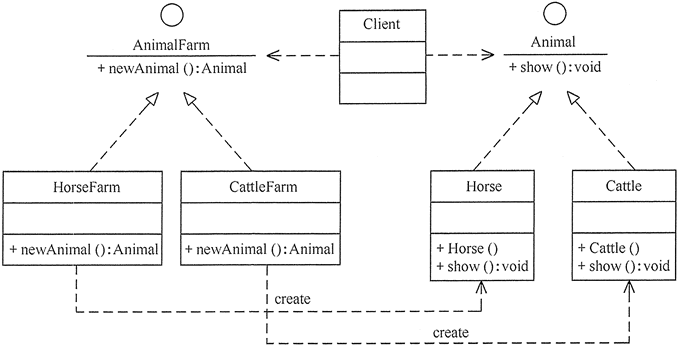
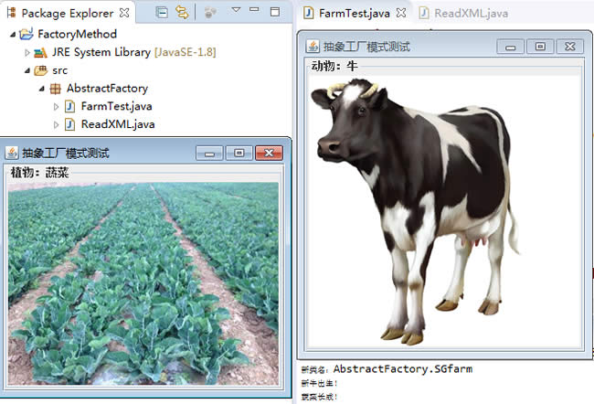
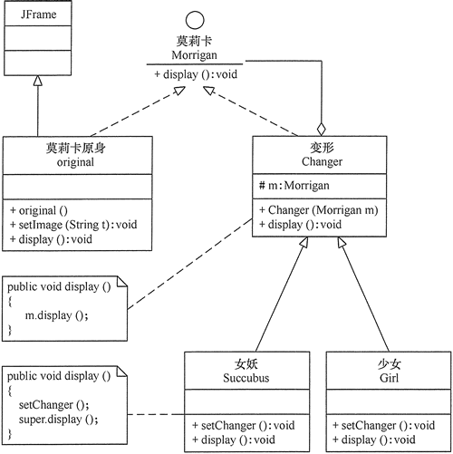

# 1.简单工厂模式

现实生活中，原始社会自给自足（没有工厂），农耕社会小作坊（简单工厂，民间酒坊），工业革命流水线（工厂方法，自产自销），现代产业链代工厂（抽象工厂，富士康）。我们的项目代码同样是由简到繁一步一步迭代而来的，但对于调用者来说，却越来越简单。

在日常开发中，凡是需要生成复杂对象的地方，都可以尝试考虑使用工厂模式来代替。

> 注意：上述复杂对象指的是类的构造函数参数过多等对类的构造有影响的情况，因为类的构造过于复杂，如果直接在其他业务类内使用，则两者的耦合过重，后续业务更改，就需要在任何引用该类的源代码内进行更改，光是查找所有依赖就很消耗时间了，更别说要一个一个修改了。

工厂模式的定义：定义一个创建产品对象的工厂接口，将产品对象的实际创建工作推迟到具体子工厂类当中。这满足创建型模式中所要求的“创建与使用相分离”的特点。

按实际业务场景划分，工厂模式有 3 种不同的实现方式，分别是简单工厂模式、工厂方法模式和抽象工厂模式。

我们把被创建的对象称为“产品”，把创建产品的对象称为“工厂”。如果要创建的产品不多，只要一个工厂类就可以完成，这种模式叫“简单工厂模式”。

在简单工厂模式中创建实例的方法通常为静态（static）方法，因此

简单工厂模式（Simple Factory Pattern）又叫作静态工厂方法模式（Static Factory Method Pattern）。

简单来说，简单工厂模式有一个具体的工厂类，可以生成多个不同的产品，属于创建型设计模式。简单工厂模式不在 GoF 23 种设计模式之列。

简单工厂模式每增加一个产品就要增加一个具体产品类和一个对应的具体工厂类，这增加了系统的复杂度，违背了“开闭原则”。

> “工厂方法模式”是对简单工厂模式的进一步抽象化，其好处是可以使系统在不修改原来代码的情况下引进新的产品，即满足开闭原则。

## 优点和缺点

#### 优点：

1. 工厂类包含必要的逻辑判断，可以决定在什么时候创建哪一个产品的实例。客户端可以免除直接创建产品对象的职责，很方便的创建出相应的产品。工厂和产品的职责区分明确。
2. 客户端无需知道所创建具体产品的类名，只需知道参数即可。
3. 也可以引入配置文件，在不修改客户端代码的情况下更换和添加新的具体产品类。

#### 缺点：

1. 简单工厂模式的工厂类单一，负责所有产品的创建，职责过重，一旦异常，整个系统将受影响。且工厂类代码会非常臃肿，违背高聚合原则。
2. 使用简单工厂模式会增加系统中类的个数（引入新的工厂类），增加系统的复杂度和理解难度
3. 系统扩展困难，一旦增加新产品不得不修改工厂逻辑，在产品类型较多时，可能造成逻辑过于复杂
4. 简单工厂模式使用了 static 工厂方法，造成工厂角色无法形成基于继承的等级结构。

#### 应用场景

对于产品种类相对较少的情况，考虑使用简单工厂模式。使用简单工厂模式的客户端只需要传入工厂类的参数，不需要关心如何创建对象的逻辑，可以很方便地创建所需产品。

## 模式的结构与实现

简单工厂模式的主要角色如下：

- 简单工厂（SimpleFactory）：是简单工厂模式的核心，负责实现创建所有实例的内部逻辑。工厂类的创建产品类的方法可以被外界直接调用，创建所需的产品对象。
- 抽象产品（Product）：是简单工厂创建的所有对象的父类，负责描述所有实例共有的公共接口。
- 具体产品（ConcreteProduct）：是简单工厂模式的创建目标。

其结构图如下图所示。

简单工厂模式的结构图
图 1 简单工厂模式的结构图


根据上图写出该模式的代码如下：

```java
public class Client {
    public static void main(String[] args) {
    }
    //抽象产品
    public interface Product {
        void show();
    }
    //具体产品：ProductA
    static class ConcreteProduct1 implements Product {
        public void show() {
            System.out.println("具体产品1显示...");
        }
    }
    //具体产品：ProductB
    static class ConcreteProduct2 implements Product {
        public void show() {
            System.out.println("具体产品2显示...");
        }
    }
    final class Const {
        static final int PRODUCT_A = 0;
        static final int PRODUCT_B = 1;
        static final int PRODUCT_C = 2;
    }
    static class SimpleFactory {
        public static Product makeProduct(int kind) {
            switch (kind) {
                case Const.PRODUCT_A:
                    return new ConcreteProduct1();
                case Const.PRODUCT_B:
                    return new ConcreteProduct2();
            }
            return null;
        }
    }
}
```

## 进阶阅读

如果您想了解简单工厂模式在框架源码中的应用，可猛击阅读《简单工厂模式在框架源码中的应用》文章。

# 2.工厂方法模式（详解版）

在现实生活中社会分工越来越细，越来越专业化。各种产品有专门的工厂生产，彻底告别了自给自足的小农经济时代，这大大缩短了产品的生产周期，提高了生产效率。同样，在软件开发中能否做到软件对象的生产和使用相分离呢？能否在满足“开闭原则”的前提下，客户随意增删或改变对软件相关对象的使用呢？这就是本节要讨论的问题。

在《简单工厂模式》一节我们介绍了简单工厂模式，提到了简单工厂模式违背了开闭原则，而“工厂方法模式”是对简单工厂模式的进一步抽象化，其好处是可以使系统在不修改原来代码的情况下引进新的产品，即满足开闭原则。

#### 优点：

- 用户只需要知道具体工厂的名称就可得到所要的产品，无须知道产品的具体创建过程。
- 灵活性增强，对于新产品的创建，只需多写一个相应的工厂类。
- 典型的解耦框架。高层模块只需要知道产品的抽象类，无须关心其他实现类，满足迪米特法则、依赖倒置原则和里氏替换原则。

#### 缺点：

- 类的个数容易过多，增加复杂度
- 增加了系统的抽象性和理解难度
- 抽象产品只能生产一种产品，此弊端可使用[抽象工厂模式](http://c.biancheng.net/view/1351.html)解决。

#### 应用场景：

- 客户只知道创建产品的工厂名，而不知道具体的产品名。如 TCL 电视工厂、海信电视工厂等。
- 创建对象的任务由多个具体子工厂中的某一个完成，而抽象工厂只提供创建产品的接口。
- 客户不关心创建产品的细节，只关心产品的品牌

## 模式的结构与实现

工厂方法模式由抽象工厂、具体工厂、抽象产品和具体产品等4个要素构成。本节来分析其基本结构和实现方法。

#### 1. 模式的结构

工厂方法模式的主要角色如下。

1. 抽象工厂（Abstract Factory）：提供了创建产品的接口，调用者通过它访问具体工厂的工厂方法 newProduct() 来创建产品。
2. 具体工厂（ConcreteFactory）：主要是实现抽象工厂中的抽象方法，完成具体产品的创建。
3. 抽象产品（Product）：定义了产品的规范，描述了产品的主要特性和功能。
4. 具体产品（ConcreteProduct）：实现了抽象产品角色所定义的接口，由具体工厂来创建，它同具体工厂之间一一对应。

其结构图如图 1 所示。


图1 工厂方法模式的结构图

#### 2. 模式的实现

根据图 1 写出该模式的代码如下：

```java
package FactoryMethod;
public class AbstractFactoryTest {    
    public static void main(String[] args) {        
        try {            
            Product a;            
            AbstractFactory af;            
            af = (AbstractFactory) ReadXML1.getObject();            
            a = af.newProduct();            
            a.show();        
        } catch (Exception e) {            
            System.out.println(e.getMessage());        
        }    
    }
}
//抽象产品：提供了产品的接口
interface Product {    public void show();}
//具体产品1：实现抽象产品中的抽象方法
class ConcreteProduct1 implements Product {    
    public void show() {        
        System.out.println("具体产品1显示...");    
    }
}
//具体产品2：实现抽象产品中的抽象方法
class ConcreteProduct2 implements Product {    
    public void show() {        
        System.out.println("具体产品2显示...");    
    }
}
//抽象工厂：提供了厂品的生成方法
interface AbstractFactory {    
    public Product newProduct();
}
//具体工厂1：实现了厂品的生成方法
class ConcreteFactory1 implements AbstractFactory {    
    public Product newProduct() {        
        System.out.println("具体工厂1生成-->具体产品1...");        
        return new ConcreteProduct1();    
    }
}
//具体工厂2：实现了厂品的生成方法
class ConcreteFactory2 implements AbstractFactory {    
    public Product newProduct() {        
        System.out.println("具体工厂2生成-->具体产品2...");        
        return new ConcreteProduct2();    
    }
}
package FactoryMethod;
import javax.xml.parsers.*;
import org.w3c.dom.*;
import java.io.*;
class ReadXML1 {    
    //该方法用于从XML配置文件中提取具体类类名，并返回一个实例对象    
    public static Object getObject() {        
        try {            
            //创建文档对象            
            DocumentBuilderFactory dFactory = DocumentBuilderFactory.newInstance();            
            DocumentBuilder builder = dFactory.newDocumentBuilder();            
            Document doc;            
            doc = builder.parse(new File("src/FactoryMethod/config1.xml"));            
            //获取包含类名的文本节点            
            NodeList nl = doc.getElementsByTagName("className");            
            Node classNode = nl.item(0).getFirstChild();            
            String cName = "FactoryMethod." + classNode.getNodeValue();            
            //System.out.println("新类名："+cName);            
            // 通过类名生成实例对象并将其返回            
            lass<?> c = Class.forName(cName);            
            Object obj = c.newInstance();            
            return obj;        
        } catch (Exception e) {            
            e.printStackTrace();            
            return null;        
        }    
    }
}
```

注意：该程序中用到了 XML 文件，如果想要获取该文件，请点击“

下载

”，就可以对其进行下载。

程序运行结果如下：

```
具体工厂1生成-->具体产品1...
具体产品1显示...
```

如果将 XML 配置文件中的 ConcreteFactory1 改为 ConcreteFactory2，则程序运行结果如下：

```
具体工厂2生成-->具体产品2...
具体产品2显示...
```

## 模式的应用实例

【例1】用工厂方法模式设计畜牧场。

分析：有很多种类的畜牧场，如养马场用于养马，养牛场用于养牛，所以该实例用工厂方法模式比较适合。

对养马场和养牛场等具体工厂类，只要定义一个生成动物的方法 newAnimal() 即可。由于要显示马类和牛类等具体产品类的图像，所以它们的构造函数中用到了 JPanel、JLabd 和 ImageIcon 等组件，并定义一个 show() 方法来显示它们。

客户端程序通过对象生成器类 ReadXML2 读取 XML 配置文件中的数据来决定养马还是养牛。其结构图如图 2 所示。


图2 畜牧场结构图

注意：该程序中用到了 XML 文件，并且要显示马类和牛类等具体产品类的图像，如果想要获取 HTML 文件和图片，请点击“

下载

”，就可以对其进行下载。

程序代码如下：

```java
package FactoryMethod;
import java.awt.*;
import javax.swing.*;

public class AnimalFarmTest {
    public static void main(String[] args) {
        try {
            Animal a;
            AnimalFarm af;
            af = (AnimalFarm) ReadXML2.getObject();
            a = af.newAnimal();
            a.show();
        } catch (Exception e) {
            System.out.println(e.getMessage());
        }
    }
}
//抽象产品：动物类
interface Animal {    public void show();}
//具体产品：马类
class Horse implements Animal {
    JScrollPane sp;
    JFrame jf = new JFrame("工厂方法模式测试");

    public Horse() {
        Container contentPane = jf.getContentPane();
        JPanel p1 = new JPanel();
        p1.setLayout(new GridLayout(1, 1));
        p1.setBorder(BorderFactory.createTitledBorder("动物：马"));
        sp = new JScrollPane(p1);
        contentPane.add(sp, BorderLayout.CENTER);
        JLabel l1 = new JLabel(new ImageIcon("src/A_Horse.jpg"));
        p1.add(l1);
        jf.pack();
        jf.setVisible(false);
        jf.setDefaultCloseOperation(JFrame.EXIT_ON_CLOSE);
        //用户点击窗口关闭
    }
    public void show() {
        jf.setVisible(true);
    }
}
//具体产品：牛类
class Cattle implements Animal {
    JScrollPane sp;
    JFrame jf = new JFrame("工厂方法模式测试");

    public Cattle() {
        Container contentPane = jf.getContentPane();
        JPanel p1 = new JPanel();
        p1.setLayout(new GridLayout(1, 1));
        p1.setBorder(BorderFactory.createTitledBorder("动物：牛"));
        sp = new JScrollPane(p1);
        contentPane.add(sp, BorderLayout.CENTER);
        JLabel l1 = new JLabel(new ImageIcon("src/A_Cattle.jpg"));
        p1.add(l1);
        jf.pack();
        jf.setVisible(false);
        jf.setDefaultCloseOperation(JFrame.EXIT_ON_CLOSE);
        //用户点击窗口关闭
    }
    public void show() {        
        jf.setVisible(true);
    }
}
//抽象工厂：畜牧场
interface AnimalFarm {    public Animal newAnimal();}
//具体工厂：养马场
class HorseFarm implements AnimalFarm {
    public Animal newAnimal() {
        System.out.println("新马出生！");
        return new Horse();
    }
}
//具体工厂：养牛场
class CattleFarm implements AnimalFarm {
    public Animal newAnimal() {
        System.out.println("新牛出生！");
        return new Cattle();
    }
}
package FactoryMethod;
import javax.xml.parsers.*;
import org.w3c.dom.*;
import java.io.*;

class ReadXML2 {
    public static Object getObject() {
        try {
            DocumentBuilderFactory dFactory = DocumentBuilderFactory.newInstance();
            DocumentBuilder builder = dFactory.newDocumentBuilder();
            Document doc;
            doc = builder.parse(new File("src/FactoryMethod/config2.xml"));
            NodeList nl = doc.getElementsByTagName("className");
            Node classNode = nl.item(0).getFirstChild();
            String cName = "FactoryMethod." + classNode.getNodeValue();
            System.out.println("新类名：" + cName);
            Class<?> c = Class.forName(cName);
            Object obj = c.newInstance();
            return obj;
        } catch (Exception e) {
            e.printStackTrace();
            return null;
        }
    }
}
```

程序的运行结果如图 3 所示。


图3 畜牧场养殖的运行结果

注意：当需要生成的产品不多且不会增加，一个具体工厂类就可以完成任务时，可删除抽象工厂类。这时工厂方法模式将退化到简单工厂模式。


## 进阶阅读

如果您想了解工厂方法模式在框架源码中的应用，可猛击阅读《工厂方法模式在Logback源码中的应用》文章。

# 3.抽象工厂模式（详解版）


前面介绍的工厂方法模式中考虑的是一类产品的生产，如畜牧场只养动物、电视机厂只生产电视机、计算机软件学院只培养计算机软件专业的学生等。

同种类称为同等级，也就是说：工厂方法模式

只考虑生产同等级的产品，但是在现实生活中许多工厂是综合型的工厂，能生产多等级（种类） 的产品，如农场里既养动物又种植物，电器厂既生产电视机又生产洗衣机或空调，大学既有软件专业又有生物专业等。

本节要介绍的抽象工厂模式将考虑多等级产品的生产，将同一个具体工厂所生产的位于不同等级的一组产品称为一个产品族，图 1 所示的是海尔工厂和 TCL 工厂所生产的电视机与空调对应的关系图。


图1 电器工厂的产品等级与产品族

## 模式的定义与特点

抽象工厂（AbstractFactory）模式的定义：是一种为访问类提供一个创建一组相关或相互依赖对象的接口，且访问类无须指定所要产品的具体类就能得到同族的不同等级的产品的模式结构。

抽象工厂模式是工厂方法模式的升级版本，工厂方法模式只生产一个等级的产品，而抽象工厂模式可生产多个等级的产品。

使用抽象工厂模式一般要满足以下条件。

- 系统中有多个产品族，每个具体工厂创建同一族但属于不同等级结构的产品。
- 系统一次只可能消费其中某一族产品，即同族的产品一起使用。

抽象工厂模式除了具有工厂方法模式的优点外，其他主要优点如下。

- 可以在类的内部对产品族中相关联的多等级产品共同管理，而不必专门引入多个新的类来进行管理。
- 当需要产品族时，抽象工厂可以保证客户端始终只使用同一个产品的产品组。
- 抽象工厂增强了程序的可扩展性，当增加一个新的产品族时，不需要修改原代码，满足开闭原则。

其缺点是：当产品族中需要增加一个新的产品时，所有的工厂类都需要进行修改。增加了系统的抽象性和理解难度。

## 模式的结构与实现

抽象工厂模式同工厂方法模式一样，也是由抽象工厂、具体工厂、抽象产品和具体产品等 4 个要素构成，但抽象工厂中方法个数不同，抽象产品的个数也不同。现在我们来分析其基本结构和实现方法。

#### 1. 模式的结构

抽象工厂模式的主要角色如下。

1. 抽象工厂（Abstract Factory）：提供了创建产品的接口，它包含多个创建产品的方法 newProduct()，可以创建多个不同等级的产品。
2. 具体工厂（Concrete Factory）：主要是实现抽象工厂中的多个抽象方法，完成具体产品的创建。
3. 抽象产品（Product）：定义了产品的规范，描述了产品的主要特性和功能，抽象工厂模式有多个抽象产品。
4. 具体产品（ConcreteProduct）：实现了抽象产品角色所定义的接口，由具体工厂来创建，它同具体工厂之间是多对一的关系。

抽象工厂模式的结构图如图 2 所示。


图2 抽象工厂模式的结构图

#### 2. 模式的实现

从图 2 可以看出抽象工厂模式的结构同工厂方法模式的结构相似，不同的是其产品的种类不止一个，所以创建产品的方法也不止一个。下面给出抽象工厂和具体工厂的代码。

(1) 抽象工厂：提供了产品的生成方法。

```java
interface AbstractFactory {
    public Product1 newProduct1();
    public Product2 newProduct2();
}
```

(2) 具体工厂：实现了产品的生成方法。

```java
class ConcreteFactory1 implements AbstractFactory {
    public Product1 newProduct1() {
        System.out.println("具体工厂 1 生成-->具体产品 11...");
        return new ConcreteProduct11();
    }
    public Product2 newProduct2() {
        System.out.println("具体工厂 1 生成-->具体产品 21...");
        return new ConcreteProduct21();
    }
}
```


## 模式的应用实例

【例1】用抽象工厂模式设计农场类。

分析：农场中除了像畜牧场一样可以养动物，还可以培养植物，如养马、养牛、种菜、种水果等，所以本实例比前面介绍的畜牧场类复杂，必须用抽象工厂模式来实现。

本例用抽象工厂模式来设计两个农场，一个是韶关农场用于养牛和种菜，一个是上饶农场用于养马和种水果，可以在以上两个农场中定义一个生成动物的方法 newAnimal() 和一个培养植物的方法 newPlant()。

对马类、牛类、蔬菜类和水果类等具体产品类，由于要显示它们的图像（点此下载图片），所以它们的构造函数中用到了 JPanel、JLabel 和 ImageIcon 等组件，并定义一个 show() 方法来显示它们。

客户端程序通过对象生成器类 ReadXML 读取 XML 配置文件中的数据来决定养什么动物和培养什么植物（点此下载 XML 文件）。其结构图如图 3 所示。


图3 农场类的结构图

程序代码如下：

```java
package AbstractFactory;
import java.awt.*;
import javax.swing.*;
public class FarmTest {
    public static void main(String[] args) {
        try {
            Farm f;
            Animal a;
            Plant p;
            f = (Farm) ReadXML.getObject();
            a = f.newAnimal();
            p = f.newPlant();
            a.show();
            p.show();
        } catch (Exception e) {
            System.out.println(e.getMessage());
        }
    }
}
//抽象产品：动物类
interface Animal {
    public void show();
}
//具体产品：马类
class Horse implements Animal {
    JScrollPane sp;
    JFrame jf = new JFrame("抽象工厂模式测试");
    public Horse() {
        Container contentPane = jf.getContentPane();
        JPanel p1 = new JPanel();
        p1.setLayout(new GridLayout(1, 1));
        p1.setBorder(BorderFactory.createTitledBorder("动物：马"));
        sp = new JScrollPane(p1);
        contentPane.add(sp, BorderLayout.CENTER);
        JLabel l1 = new JLabel(new ImageIcon("src/A_Horse.jpg"));
        p1.add(l1);
        jf.pack();
        jf.setVisible(false);
        jf.setDefaultCloseOperation(JFrame.EXIT_ON_CLOSE);//用户点击窗口关闭
    }
    public void show() {
        jf.setVisible(true);
    }
}
//具体产品：牛类
class Cattle implements Animal {
    JScrollPane sp;
    JFrame jf = new JFrame("抽象工厂模式测试");
    public Cattle() {
        Container contentPane = jf.getContentPane();
        JPanel p1 = new JPanel();
        p1.setLayout(new GridLayout(1, 1));
        p1.setBorder(BorderFactory.createTitledBorder("动物：牛"));
        sp = new JScrollPane(p1);
        contentPane.add(sp, BorderLayout.CENTER);
        JLabel l1 = new JLabel(new ImageIcon("src/A_Cattle.jpg"));
        p1.add(l1);
        jf.pack();
        jf.setVisible(false);
        jf.setDefaultCloseOperation(JFrame.EXIT_ON_CLOSE);//用户点击窗口关闭
    }
    public void show() {
        jf.setVisible(true);
    }
}
//抽象产品：植物类
interface Plant {
    public void show();
}
//具体产品：水果类
class Fruitage implements Plant {
    JScrollPane sp;
    JFrame jf = new JFrame("抽象工厂模式测试");
    public Fruitage() {
        Container contentPane = jf.getContentPane();
        JPanel p1 = new JPanel();
        p1.setLayout(new GridLayout(1, 1));
        p1.setBorder(BorderFactory.createTitledBorder("植物：水果"));
        sp = new JScrollPane(p1);
        contentPane.add(sp, BorderLayout.CENTER);
        JLabel l1 = new JLabel(new ImageIcon("src/P_Fruitage.jpg"));
        p1.add(l1);
        jf.pack();
        jf.setVisible(false);
        jf.setDefaultCloseOperation(JFrame.EXIT_ON_CLOSE);//用户点击窗口关闭
    }
    public void show() {
        jf.setVisible(true);
    }
}
//具体产品：蔬菜类
class Vegetables implements Plant {
    JScrollPane sp;
    JFrame jf = new JFrame("抽象工厂模式测试");
    public Vegetables() {
        Container contentPane = jf.getContentPane();
        JPanel p1 = new JPanel();
        p1.setLayout(new GridLayout(1, 1));
        p1.setBorder(BorderFactory.createTitledBorder("植物：蔬菜"));
        sp = new JScrollPane(p1);
        contentPane.add(sp, BorderLayout.CENTER);
        JLabel l1 = new JLabel(new ImageIcon("src/P_Vegetables.jpg"));
        p1.add(l1);
        jf.pack();
        jf.setVisible(false);
        jf.setDefaultCloseOperation(JFrame.EXIT_ON_CLOSE);//用户点击窗口关闭
    }
    public void show() {
        jf.setVisible(true);
    }
}
//抽象工厂：农场类
interface Farm {
    public Animal newAnimal();
    public Plant newPlant();
}
//具体工厂：韶关农场类
class SGfarm implements Farm {
    public Animal newAnimal() {
        System.out.println("新牛出生！");
        return new Cattle();
    }
    public Plant newPlant() {
        System.out.println("蔬菜长成！");
        return new Vegetables();
    }
}
//具体工厂：上饶农场类
class SRfarm implements Farm {
    public Animal newAnimal() {
        System.out.println("新马出生！");
        return new Horse();
    }
    public Plant newPlant() {
        System.out.println("水果长成！");
        return new Fruitage();
    }
}

package AbstractFactory;
import javax.xml.parsers.*;
import org.w3c.dom.*;
import java.io.*;
class ReadXML {
    public static Object getObject() {
        try {
            DocumentBuilderFactory dFactory = DocumentBuilderFactory.newInstance();
            DocumentBuilder builder = dFactory.newDocumentBuilder();
            Document doc;
            doc = builder.parse(new File("src/AbstractFactory/config.xml"));
            NodeList nl = doc.getElementsByTagName("className");
            Node classNode = nl.item(0).getFirstChild();
            String cName = "AbstractFactory." + classNode.getNodeValue();
            System.out.println("新类名：" + cName);
            Class<?> c = Class.forName(cName);
            Object obj = c.newInstance();
            return obj;
        } catch (Exception e) {
            e.printStackTrace();
            return null;
        }
    }
}
```


程序运行结果如图 4 所示。


图4 农场养殖的运行结果

## 模式的应用场景

抽象工厂模式最早的应用是用于创建属于不同操作系统的视窗构件。

如 Java的 AWT 中的 Button 和 Text 等构件在 Windows 和 UNIX 中的本地实现是不同的。

抽象工厂模式通常适用于以下场景：

1. 当需要创建的对象是一系列相互关联或相互依赖的产品族时，如电器工厂中的电视机、洗衣机、空调等。
2. 系统中有多个产品族，但每次只使用其中的某一族产品。如有人只喜欢穿某一个品牌的衣服和鞋。
3. 系统中提供了产品的类库，且所有产品的接口相同，客户端不依赖产品实例的创建细节和内部结构。

## 模式的扩展

抽象工厂模式的扩展有一定的“开闭原则”倾斜性：

1. 当增加一个新的产品族时只需增加一个新的具体工厂，不需要修改原代码，满足开闭原则。
2. 当产品族中需要增加一个新种类的产品时，则所有的工厂类都需要进行修改，不满足开闭原则。

另一方面，当系统中只存在一个等级结构的产品时，抽象工厂模式将退化到工厂方法模式。

## 进阶阅读

如果您想了解抽象工厂在框架源码中的应用，可猛击阅读以下文章。

- [《抽象工厂在Java源码中的应用》](http://c.biancheng.net/view/vip_8392.html)
- [《抽象工厂模式在Spring源码中的应用》](http://c.biancheng.net/view/vip_8393.html)

# 4.装饰器模式（装饰设计模式）详解

上班族大多都有睡懒觉的习惯，每天早上上班时间都很紧张，于是很多人为了多睡一会，就会用方便的方式解决早餐问题。有些人早餐可能会吃煎饼，煎饼中可以加鸡蛋，也可以加香肠，但是不管怎么“加码”，都还是一个煎饼。在现实生活中，常常需要对现有产品增加新的功能或美化其外观，如房子装修、相片加相框等，都是装饰器模式。

在软件开发过程中，有时想用一些现存的组件。这些组件可能只是完成了一些核心功能。但在不改变其结构的情况下，可以动态地扩展其功能。所有这些都可以釆用装饰器模式来实现。

## 装饰器模式的定义与特点

装饰器（Decorator）模式的定义：指在不改变现有对象结构的情况下，动态地给该对象增加一些职责（即增加其额外功能）的模式，它属于对象结构型模式。

装饰器模式的主要优点有：

- 装饰器是继承的有力补充，比继承灵活，在不改变原有对象的情况下，动态的给一个对象扩展功能，即插即用
- 通过使用不用装饰类及这些装饰类的排列组合，可以实现不同效果
- 装饰器模式完全遵守开闭原则

其主要缺点是：装饰器模式会增加许多子类，过度使用会增加程序得复杂性。

## 装饰器模式的结构与实现

通常情况下，扩展一个类的功能会使用继承方式来实现。但继承具有静态特征，耦合度高，并且随着扩展功能的增多，子类会很膨胀。如果使用组合关系来创建一个包装对象（即装饰对象）来包裹真实对象，并在保持真实对象的类结构不变的前提下，为其提供额外的功能，这就是装饰器模式的目标。下面来分析其基本结构和实现方法。

#### 1. 模式的结构

装饰器模式主要包含以下角色。

1. 抽象构件（Component）角色：定义一个抽象接口以规范准备接收附加责任的对象。
2. 具体构件（ConcreteComponent）角色：实现抽象构件，通过装饰角色为其添加一些职责。
3. 抽象装饰（Decorator）角色：继承抽象构件，并包含具体构件的实例，可以通过其子类扩展具体构件的功能。
4. 具体装饰（ConcreteDecorator）角色：实现抽象装饰的相关方法，并给具体构件对象添加附加的责任。

装饰器模式的结构图如图 1 所示。


图1 装饰器模式的结构图

#### 2. 模式的实现

装饰器模式的实现代码如下：

```java
package decorator;
public class DecoratorPattern {
    public static void main(String[] args) {
        Component p = new ConcreteComponent();
        p.operation();
        System.out.println("---------------------------------");
        Component d = new ConcreteDecorator(p);
        d.operation();
    }
}
//抽象构件角色
interface Component {
    public void operation();
}
//具体构件角色
class ConcreteComponent implements Component {
    public ConcreteComponent() {
        System.out.println("创建具体构件角色");
    }
    public void operation() {
        System.out.println("调用具体构件角色的方法operation()");
    }
}
//抽象装饰角色
class Decorator implements Component {
    private Component component;
    public Decorator(Component component) {
        this.component = component;
    }
    public void operation() {
        component.operation();
    }
}
//具体装饰角色
class ConcreteDecorator extends Decorator {
    public ConcreteDecorator(Component component) {
        super(component);
    }
    public void operation() {
        super.operation();
        addedFunction();
    }
    public void addedFunction() {
        System.out.println("为具体构件角色增加额外的功能addedFunction()");
    }
}
```


程序运行结果如下：

```
创建具体构件角色
调用具体构件角色的方法operation()
---------------------------------
调用具体构件角色的方法operation()
为具体构件角色增加额外的功能addedFunction()
```


## 装饰器模式的应用实例

【例1】用装饰器模式实现游戏角色“莫莉卡·安斯兰”的变身。

分析：在《恶魔战士》中，游戏角色“莫莉卡·安斯兰”的原身是一个可爱少女，但当她变身时，会变成头顶及背部延伸出蝙蝠状飞翼的女妖，当然她还可以变为穿着漂亮外衣的少女。这些都可用装饰器模式来实现，在本实例中的“莫莉卡”原身有 setImage(String t) 方法决定其显示方式，而其 变身“蝙蝠状女妖”和“着装少女”可以用 setChanger() 方法来改变其外观，原身与变身后的效果用 display() 方法来显示（点此下载其原身和变身后的图片），图 2 所示是其结构图。


图2 游戏角色“莫莉卡·安斯兰”的结构图

程序代码如下：

```java
package decorator;
import java.awt.*;
import javax.swing.*;
public class MorriganAensland {
    public static void main(String[] args) {
        Morrigan m0 = new original();
        m0.display();
        Morrigan m1 = new Succubus(m0);
        m1.display();
        Morrigan m2 = new Girl(m0);
        m2.display();
    }
}
//抽象构件角色：莫莉卡
interface Morrigan {
    public void display();
}
//具体构件角色：原身
class original extends JFrame implements Morrigan {
    private static final long serialVersionUID = 1L;
    private String t = "Morrigan0.jpg";
    public original() {
        super("《恶魔战士》中的莫莉卡·安斯兰");
    }
    public void setImage(String t) {
        this.t = t;
    }
    public void display() {
        this.setLayout(new FlowLayout());
        JLabel l1 = new JLabel(new ImageIcon("src/decorator/" + t));
        this.add(l1);
        this.pack();
        this.setDefaultCloseOperation(JFrame.EXIT_ON_CLOSE);
        this.setVisible(true);
    }
}
//抽象装饰角色：变形
class Changer implements Morrigan {
    Morrigan m;
    public Changer(Morrigan m) {
        this.m = m;
    }
    public void display() {
        m.display();
    }
}
//具体装饰角色：女妖
class Succubus extends Changer {
    public Succubus(Morrigan m) {
        super(m);
    }
    public void display() {
        setChanger();
        super.display();
    }
    public void setChanger() {
        ((original) super.m).setImage("Morrigan1.jpg");
    }
}
//具体装饰角色：少女
class Girl extends Changer {
    public Girl(Morrigan m) {
        super(m);
    }
    public void display() {
        setChanger();
        super.display();
    }
    public void setChanger() {
        ((original) super.m).setImage("Morrigan2.jpg");
    }
}
```

程序运行结果如图 3 所示。


图3 游戏角色“莫莉卡·安斯兰”的变身

## 装饰器模式的应用场景

前面讲解了关于装饰器模式的结构与特点，下面介绍其适用的应用场景，装饰器模式通常在以下几种情况使用。

- 当需要给一个现有类添加附加职责，而又不能采用生成子类的方法进行扩充时。例如，该类被隐藏或者该类是终极类或者采用继承方式会产生大量的子类。
- 当需要通过对现有的一组基本功能进行排列组合而产生非常多的功能时，采用继承关系很难实现，而采用装饰器模式却很好实现。
- 当对象的功能要求可以动态地添加，也可以再动态地撤销时。

装饰器模式在 

Java语言中的最著名的应用莫过于 Java I/O 标准库的设计了。例如，InputStream 的子类 FilterInputStream，OutputStream 的子类 FilterOutputStream，Reader 的子类 BufferedReader 以及 FilterReader，还有 Writer 的子类 BufferedWriter、FilterWriter 以及 PrintWriter 等，它们都是抽象装饰类。

下面代码是为 FileReader 增加缓冲区而采用的装饰类 BufferedReader 的例子：

```java
BufferedReader in = new BufferedReader(new FileReader("filename.txt"));
String s = in.readLine();
```

## 装饰器模式的扩展

装饰器模式所包含的 4 个角色不是任何时候都要存在的，在有些应用环境下模式是可以简化的，如以下两种情况。

(1) 如果只有一个具体构件而没有抽象构件时，可以让抽象装饰继承具体构件，其结构图如图 4 所示。


图4 只有一个具体构件的装饰器模式

(2) 如果只有一个具体装饰时，可以将抽象装饰和具体装饰合并，其结构图如图 5 所示。


图5 只有一个具体装饰的装饰器模式

## 进阶阅读

如果您想深入了解装饰器模式，可猛击阅读以下文章。

- [《使用装饰器模式解决煎饼“加码”问题》](http://c.biancheng.net/view/vip_8461.html)
- [《装饰器模式在JDK源码中的应用》](http://c.biancheng.net/view/vip_8463.html)
- [《装饰器模式在Spring源码中的应用》](http://c.biancheng.net/view/vip_8464.html)
- [《装饰器模式和代理模式的区别》](http://c.biancheng.net/view/vip_8466.html)


# 5.适配器模式（Adapter模式）详解

在现实生活中，经常出现两个对象因接口不兼容而不能在一起工作的实例，这时需要第三者进行适配。例如，讲中文的人同讲英文的人对话时需要一个翻译，用直流电的笔记本电脑接交流电源时需要一个电源适配器，用计算机访问照相机的 SD 内存卡时需要一个读卡器等。

在软件设计中也可能出现：需要开发的具有某种业务功能的组件在现有的组件库中已经存在，但它们与当前系统的接口规范不兼容，如果重新开发这些组件成本又很高，这时用适配器模式能很好地解决这些问题。

## 模式的定义与特点

适配器模式（Adapter）的定义如下：将一个类的接口转换成客户希望的另外一个接口，使得原本由于接口不兼容而不能一起工作的那些类能一起工作。

适配器模式分为类结构型模式和对象结构型模式两种，前者类之间的耦合度比后者高，且要求程序员了解现有组件库中的相关组件的内部结构，所以应用相对较少些。

该模式的主要优点如下。

- 客户端通过适配器可以透明地调用目标接口。
- 复用了现存的类，程序员不需要修改原有代码而重用现有的适配者类。
- 将目标类和适配者类解耦，解决了目标类和适配者类接口不一致的问题。
- 在很多业务场景中符合开闭原则。

其缺点是：

- 适配器编写过程需要结合业务场景全面考虑，可能会增加系统的复杂性。
- 增加代码阅读难度，降低代码可读性，过多使用适配器会使系统代码变得凌乱。

## 模式的结构与实现

类适配器模式可采用多重继承方式实现，如 C++可定义一个适配器类来同时继承当前系统的业务接口和现有组件库中已经存在的组件接口；Java不支持多继承，但可以定义一个适配器类来实现当前系统的业务接口，同时又继承现有组件库中已经存在的组件。对象适配器模式可釆用将现有组件库中已经实现的组件引入适配器类中，该类同时实现当前系统的业务接口。现在来介绍它们的基本结构。

#### 1. 模式的结构

适配器模式（Adapter）包含以下主要角色。

1. 目标（Target）接口：当前系统业务所期待的接口，它可以是抽象类或接口。
2. 适配者（Adaptee）类：它是被访问和适配的现存组件库中的组件接口。
3. 适配器（Adapter）类：它是一个转换器，通过继承或引用适配者的对象，把适配者接口转换成目标接口，让客户按目标接口的格式访问适配者。

类适配器模式的结构图如图 1 所示。


图1 类适配器模式的结构图

对象适配器模式的结构图如图 2 所示。


图2 对象适配器模式的结构图

#### 2. 模式的实现

(1) 类适配器模式的代码如下。

```java
package adapter;
//目标接口
interface Target
{
    public void request();
}
//适配者接口
class Adaptee
{
    public void specificRequest()
    {       
        System.out.println("适配者中的业务代码被调用！");
    }
}
//类适配器类
class ClassAdapter extends Adaptee implements Target
{
    public void request()
    {
        specificRequest();
    }
}
//客户端代码
public class ClassAdapterTest
{
    public static void main(String[] args)
    {
        System.out.println("类适配器模式测试：");
        Target target = new ClassAdapter();
        target.request();
    }
}
```

程序的运行结果如下：

```
类适配器模式测试：
适配者中的业务代码被调用！
```

(2)对象适配器模式的代码如下。

```java
package adapter;
//对象适配器类
class ObjectAdapter implements Target
{
    private Adaptee adaptee;
    public ObjectAdapter(Adaptee adaptee)
    {
        this.adaptee=adaptee;
    }
    public void request()
    {
        adaptee.specificRequest();
    }
}
//客户端代码
public class ObjectAdapterTest
{
    public static void main(String[] args)
    {
        System.out.println("对象适配器模式测试：");
        Adaptee adaptee = new Adaptee();
        Target target = new ObjectAdapter(adaptee);
        target.request();
    }
}
```

说明：对象适配器模式中的“目标接口”和“适配者类”的代码同类适配器模式一样，只要修改适配器类和客户端的代码即可。

程序的运行结果如下：

```
对象适配器模式测试：
适配者中的业务代码被调用！
```

## 模式的应用实例

【例1】用适配器模式（Adapter）模拟新能源汽车的发动机。

分析：新能源汽车的发动机有电能发动机（Electric Motor）和光能发动机（Optical Motor）等，各种发动机的驱动方法不同，例如，电能发动机的驱动方法 electricDrive() 是用电能驱动，而光能发动机的驱动方法 opticalDrive() 是用光能驱动，它们是适配器模式中被访问的适配者。

客户端希望用统一的发动机驱动方法 drive() 访问这两种发动机，所以必须定义一个统一的目标接口 Motor，然后再定义电能适配器（Electric Adapter）和光能适配器（Optical Adapter）去适配这两种发动机。

我们把客户端想访问的新能源发动机的适配器的名称放在 XML 配置文件中（点此下载 XML 文件），客户端可以通过对象生成器类 ReadXML 去读取。这样，客户端就可以通过 Motor 接口随便使用任意一种新能源发动机去驱动汽车，图 3 所示是其结构图。


图3 发动机适配器的结构图

程序代码如下：

```java
package adapter;
//目标：发动机
interface Motor
{
    public void drive();
}
//适配者1：电能发动机
class ElectricMotor
{
    public void electricDrive()
    {
        System.out.println("电能发动机驱动汽车！");
    }
}
//适配者2：光能发动机
class OpticalMotor
{
    public void opticalDrive()
    {
        System.out.println("光能发动机驱动汽车！");
    }
}
//电能适配器
class ElectricAdapter implements Motor
{
    private ElectricMotor emotor;
    public ElectricAdapter()
    {
        emotor=new ElectricMotor();
    }
    public void drive()
    {
        emotor.electricDrive();
    }
}
//光能适配器
class OpticalAdapter implements Motor
{
    private OpticalMotor omotor;
    public OpticalAdapter()
    {
        omotor=new OpticalMotor();
    }
    public void drive()
    {
        omotor.opticalDrive();
    }
}
//客户端代码
public class MotorAdapterTest
{
    public static void main(String[] args)
    {
        System.out.println("适配器模式测试：");
        Motor motor=(Motor)ReadXML.getObject();
        motor.drive();
    }
}

package adapter;
import javax.xml.parsers.*;
import org.w3c.dom.*;
import java.io.*;
class ReadXML
{
    public static Object getObject()
    {
        try
        {
            DocumentBuilderFactory dFactory=DocumentBuilderFactory.newInstance();
            DocumentBuilder builder=dFactory.newDocumentBuilder();
            Document doc;                           
            doc=builder.parse(new File("src/adapter/config.xml"));
            NodeList nl=doc.getElementsByTagName("className");
            Node classNode=nl.item(0).getFirstChild();
            String cName="adapter."+classNode.getNodeValue();
            Class<?> c=Class.forName(cName);
              Object obj=c.newInstance();
            return obj;
         }  
         catch(Exception e)
         {
                   e.printStackTrace();
                   return null;
         }
    }
}
```

程序的运行结果如下：

```
适配器模式测试：
电能发动机驱动汽车！
```

注意：如果将配置文件中的 ElectricAdapter 改为 OpticalAdapter，则运行结果如下：

```
适配器模式测试：
光能发动机驱动汽车！
```

## 模式的应用场景

适配器模式（Adapter）通常适用于以下场景。

- 以前开发的系统存在满足新系统功能需求的类，但其接口同新系统的接口不一致。
- 使用第三方提供的组件，但组件接口定义和自己要求的接口定义不同。

## 模式的扩展

适配器模式（Adapter）可扩展为双向适配器模式，双向适配器类既可以把适配者接口转换成目标接口，也可以把目标接口转换成适配者接口，其结构图如图 4 所示。


图4 双向适配器模式的结构图

程序代码如下：

```java
package adapter;
//目标接口
interface TwoWayTarget
{
    public void request();
}
//适配者接口
interface TwoWayAdaptee
{
    public void specificRequest();
}
//目标实现
class TargetRealize implements TwoWayTarget
{
    public void request()
    {       
        System.out.println("目标代码被调用！");
    }
}
//适配者实现
class AdapteeRealize implements TwoWayAdaptee
{
    public void specificRequest()
    {       
        System.out.println("适配者代码被调用！");
    }
}
//双向适配器
class TwoWayAdapter  implements TwoWayTarget,TwoWayAdaptee
{
    private TwoWayTarget target;
    private TwoWayAdaptee adaptee;
    public TwoWayAdapter(TwoWayTarget target)
    {
        this.target=target;
    }
    public TwoWayAdapter(TwoWayAdaptee adaptee)
    {
        this.adaptee=adaptee;
    }
    public void request()
    {
        adaptee.specificRequest();
    }
    public void specificRequest()
    {       
        target.request();
    }
}
//客户端代码
public class TwoWayAdapterTest
{
    public static void main(String[] args)
    {
        System.out.println("目标通过双向适配器访问适配者：");
        TwoWayAdaptee adaptee=new AdapteeRealize();
        TwoWayTarget target=new TwoWayAdapter(adaptee);
        target.request();
        System.out.println("-------------------");
        System.out.println("适配者通过双向适配器访问目标：");
        target=new TargetRealize();
        adaptee=new TwoWayAdapter(target);
        adaptee.specificRequest();
    }
}
```

程序的运行结果如下：

```
目标通过双向适配器访问适配者：
适配者代码被调用！
-------------------
适配者通过双向适配器访问目标：
目标代码被调用！
```

## 进阶阅读

如果您想了解适配器模式在实际中的应用，可猛击阅读以下文章。

- [《使用类适配器重构第三方登录自由适配》](http://c.biancheng.net/view/vip_8439.html)
- [《适配器模式在Spring源码中的应用》](http://c.biancheng.net/view/vip_8447.html)